# FSE

Dokumentation und Mitschrift des Themas Makroarchitektur.

Manuel Foidl
- [FSE](#fse)
- [Aufgabe Makroarchitektur Teil 1 (Modulith + Theorie)](#aufgabe-makroarchitektur-teil-1-modulith--theorie)
  - [Theorie: Recherchiere zu folgenden Fragestellungen und fasse deine Erkenntnisse übersichtlich und illustrativ zusammen!](#theorie-recherchiere-zu-folgenden-fragestellungen-und-fasse-deine-erkenntnisse-übersichtlich-und-illustrativ-zusammen)
    - [Was ist Sofwarearchitektur?](#was-ist-sofwarearchitektur)
    - [Wie kann man Softwarearchitektur dokumentieren?](#wie-kann-man-softwarearchitektur-dokumentieren)
    - [Welches sind die wichtigsten Eigenschaften von Langlebigen Softwarearchitekturen?  (Lilienthal)](#welches-sind-die-wichtigsten-eigenschaften-von-langlebigen-softwarearchitekturen--lilienthal)
    - [Was ist ein Modulith?](#was-ist-ein-modulith)
    - [Wie funktioniert die Ports and Adapters Architektur?](#wie-funktioniert-die-ports-and-adapters-architektur)
    - [DDD: Was sind die wesentlichen Bausteine des modellgetriebenen Entwurfs (Taktische Pattern) aus DDD?](#ddd-was-sind-die-wesentlichen-bausteine-des-modellgetriebenen-entwurfs-taktische-pattern-aus-ddd)
  - [Abgabe der Architekturanalyse des bestehenden erplite-Backends](#abgabe-der-architekturanalyse-des-bestehenden-erplite-backends)
    - [Bestellung aufgeben](#bestellung-aufgeben)
    - [Bestellung auf bezahlt setzen](#bestellung-auf-bezahlt-setzen)
    - [Packliste generieren](#packliste-generieren)
    - [Packlistenitems abhaken](#packlistenitems-abhaken)
    - [Bestellung auf IN\_DELIVERY setzen wenn alle Packlistenitems gepackt sind](#bestellung-auf-in_delivery-setzen-wenn-alle-packlistenitems-gepackt-sind)
    - [Wo findet man DDD-Bestandteile?](#wo-findet-man-ddd-bestandteile)
      - [Value Objects](#value-objects)
        - [Aggregates](#aggregates)
      - [Repositories](#repositories)
      - [Events zwischen Aggregate](#events-zwischen-aggregate)
    - [Wo findet man Ports-Und-Adapters-Architektur?](#wo-findet-man-ports-und-adapters-architektur)
  - [Dokumentation (texthelle Beschreibung, Codeauszüge, Diagramme, C4-Diagramme, Klassendiagramme) der "Architektur" von Stockmanagement anhand der gegebenen Anwendungsfälle, die schon implementiert sind:](#dokumentation-texthelle-beschreibung-codeauszüge-diagramme-c4-diagramme-klassendiagramme-der-architektur-von-stockmanagement-anhand-der-gegebenen-anwendungsfälle-die-schon-implementiert-sind)
- [Aufgabe Makroarchitektur Teil 3 (Microservices)](#aufgabe-makroarchitektur-teil-3-microservices)
  - [Inbetriebnahme der Microservice-Variante von erplite](#inbetriebnahme-der-microservice-variante-von-erplite)
  - [Abgabe einer Architekturanalyse des bestehenden erplitems-Backends](#abgabe-einer-architekturanalyse-des-bestehenden-erplitems-backends)
    - [Schriftliche Dokumentation der Architektur als C4-Containerdiagramm und C4-Componentendiagramm incl. textuellen Beschreibungen, Codeauszügen und Screenshots.](#schriftliche-dokumentation-der-architektur-als-c4-containerdiagramm-und-c4-componentendiagramm-incl-textuellen-beschreibungen-codeauszügen-und-screenshots)
    - [Die beschriebenen Use-Cases (Bestellung anlegen, Payment verifizieren, Packlistenitems abhaken) entlang der Architektur beschreiben, Codeauszüge zeigen, Screenshots mit den Resultaten zeigen, textuelle Beschreibungen dazu](#die-beschriebenen-use-cases-bestellung-anlegen-payment-verifizieren-packlistenitems-abhaken-entlang-der-architektur-beschreiben-codeauszüge-zeigen-screenshots-mit-den-resultaten-zeigen-textuelle-beschreibungen-dazu)
      - [Bestellung anlegen](#bestellung-anlegen)
      - [Payment verifizieren](#payment-verifizieren)
      - [Packlistenitems abhaken](#packlistenitems-abhaken-1)
  


# Aufgabe Makroarchitektur Teil 1 (Modulith + Theorie)

## Theorie: Recherchiere zu folgenden Fragestellungen und fasse deine Erkenntnisse übersichtlich und illustrativ zusammen!

### Was ist Sofwarearchitektur?
Eine Softwarearchitektur definiert, wie sich ein System aus seinen einzelnen Komponenten
aufbaut. Sie beschreibt die Schnittstellen, über die diese miteinander verbunden sind, und
darüber hinaus die Abläufe dieses Zusammenspiels. Es wird im Zuge dessen auf alle Entscheidungen
Einfluss genommen, welche in Zusammenhang damit stehen. Insbesondere
auf Technologieauswahl und die Abbildung auf operative Systeme. Ziel ist es dabei immer,
damit die funktionalen, wie auch die nichtfunktionalen Anforderungen des Auftraggebers
zu erfüllen.
### Wie kann man Softwarearchitektur dokumentieren?
  Die Softwarearchitektur kann am einfachsten mithilfe von Diagrammen dokumentiert bzw. beschrieben werden. Dies erfolgt am besten mit mehreren Schichten wie zum Beispiel ein C4-Diagramm oder ein 4+1 Schichtenmodell.
### Welches sind die wichtigsten Eigenschaften von Langlebigen Softwarearchitekturen?  (Lilienthal)
  - **Entwurf nach Zuständigkeit**: Sind die Bausteine eines Systems modular gestaltet, so sollte man für jeden Baustein die Frage beantworten können: Was ist sein Aufgabe? Der entscheidende Punkt dabei ist, dass der Baustein wirklich eine Aufgabe hat und nicht mehrere. Diese Frage ist natürlich nur im fachlichen Kontext des jeweiligen Systems gemeinsam mit dem Entwicklerteam zu klären. Anhaltspunkte bei der Suche nach Bausteinen mit unklarer Zuständigkeit sind:
    - Der Name des Bausteins – der Name sollte seine Aufgabe beschreiben. Ist der Name schwammig, so sollte man ihn sich ansehen.
    - Seine Größe (s. nächster Punkt).
    - Der Umfang seiner Kopplung mit anderen Bausteinen – wird ein Baustein sehr viel von allen möglichen anderen Bausteinen verwendet, so liegt die Vermutung nahe, dass er ein Sammelbecken von vielfältigen nicht unbedingt zusammenhängenden Funktionalitäten ist.
    - Seine mangelnde Musterkonsistenz.
  - **Ausgewogene Größenverhältnisse**: Bausteine, die auf einer Ebene liegen, also die Schichten, die fachlichen Module, die Packages, die Klassen oder die Methoden, sollten untereinander ausgewogene Größenverhältnisse haben. Hier lohnt es sich, die sehr großen Bausteine zu untersuchen, um festzustellen, ob sie Kandidaten für eine Zerlegung sind.
  - **Zusammengehörigkeit durch Kopplung untereinander** : Bausteine sollten Subbausteine enthalten, die zusammengehören. Eine Klasse sollte beispielsweise Methoden enthalten, die gemeinsam ein Ganzes ergeben. Dasselbe gilt für größere Bausteine, wie Packages, Komponenten, Module und Schichten. Haben die Subbausteine mehr mit anderen Bausteinen zu tun, als mit ihren "Schwestern und Brüdern", dann stellt sich die Frage, ob sie nicht eigentlich in einen anderen Baustein gehören.
  
### Was ist ein Modulith?
  
  

Wenn man die zusätzliche Infrastrukturkomplexität einer Microservices-Architektur scheut, auf der anderen Seite aber eine pflegbare und verlässliche Anwendung benötigt, bietet sich ein Modulith an. Abbildung 1 zeigt in der Mitte beispielhaft einen solchen Modulithen. Obwohl er nach außen als einheitliches Artefakt auftritt, ist er im Inneren gut und sauber strukturiert.

Vorteile:
  - verlässliche Konfiguration
  - strenge Kapselung der einzelnen Module 
  
Nachteile:
  - strenge Architekturreview durch ein übergreifendes Architekturgremium, um die angedachte Architektur durchzusetzen
  -  Oft endet man hier bei einer Neuimplementierung der Gesamtapplikation.
  
Abbildung für eine Übersicht über die Architekturen:
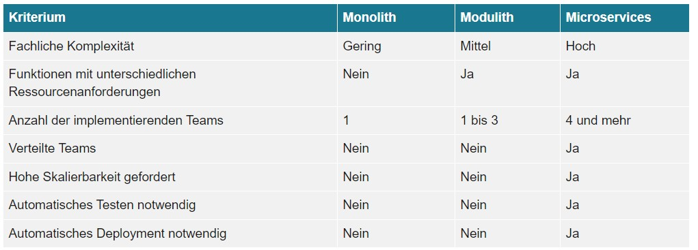

  Source: https://entwickler.de/software-architektur/microservices-oder-monolithen-beides

### Wie funktioniert die Ports and Adapters Architektur?
Ports und Adapter-Architektur schlägt vor, unsere Anwendung in verschiedene Schichten oder Bereiche aufzuteilen, von denen jeder seine eigene Verantwortung hat, so dass sie sich isoliert entwickeln können und jeder von ihnen testbar und unabhängig von den anderen ist.

Um diese Schichtenunabhängigkeit zu erreichen, wird das Konzept von Ports und Adaptern verwendet. Ein Port ist nichts anderes als ein logisches Konzept, mit dem ein Ein- und Austrittspunkt der Anwendung definiert wird. Die Funktion des Adapters ist es, die Verbindung zu diesem Port und anderen externen Diensten zu implementieren. Auf diese Weise können wir mehrere Adapter für denselben Port haben. Zum Beispiel wird unser Framework einen SQL-Port für jede Anzahl von verschiedenen Datenbankservern anpassen, die unsere Anwendung verwenden kann.


Für weitere Informationen: https://wata.es/de/hexagonale-architektur-einfuehrung-und-aufbau/


### DDD: Was sind die wesentlichen Bausteine des modellgetriebenen Entwurfs (Taktische Pattern) aus DDD?

Domain-driven Design ist nicht nur eine Technik oder Methode. Es ist vielmehr eine Denkweise und Priorisierung zur Steigerung der Produktivität von Softwareprojekten im Umfeld komplexer fachlicher Zusammenhänge. Domain-driven Design basiert auf folgenden zwei Annahmen:

- Der Schwerpunkt des Softwaredesigns liegt auf der Fachlichkeit und der Fachlogik.
- Der Entwurf komplexer fachlicher Zusammenhänge sollte auf einem Modell der Anwendungsdomäne, dem Domänenmodell basieren.

Domain-driven Design ist an keinen bestimmten Softwareentwicklungsprozess gebunden, orientiert sich aber an agiler Softwareentwicklung. Insbesondere setzt es iterative Softwareentwicklung und eine enge Zusammenarbeit zwischen Entwicklern und Fachexperten voraus.

Der Sinn jeder Software ist es, die Aufgabenstellungen einer bestimmten Anwendungsdomäne zu unterstützen. Um dies erfolgreich leisten zu können, muss die Software harmonisch zu der Fachlichkeit der Anwendungsdomäne passen, für die sie bestimmt ist. Domain-driven Design ermöglicht dies, indem die Software grundlegende Konzepte und Elemente der Anwendungsdomäne sowie deren Beziehungen modelliert.

Die Architektur ist geprägt durch die Existenz einer expliziten Geschäftslogikschicht. Diese Schicht soll die Domänen-Klassen von anderen Funktionen des Systems entkoppeln und möglichst leicht erkennbar machen. Verschiedene Architekturstile können eingesetzt werden, um die Geschäftslogikschicht einzubetten. Dazu zählen die Schichtenarchitektur und die hexagonale Architektur.

Die Klassen des Domänenmodells enthalten im Domain-driven Design sowohl die Daten als auch die gesamte Funktionalität der umzusetzenden Fachlichkeit, also die gesamte Fachlogik. Reine Datenklassen nur mit Zugriffsmethoden aber ohne fachliche Funktionalität gelten als Code-Smell. Ein auf Datenklassen aufbauendes Domänenmodell wird anämisch genannt und gilt demzufolge als Antipattern, da es ein Domänenmodell ohne Fachlogik beschreibt.

Ubiquitäre Sprache

Domain-driven Design basiert auf einer Reihe von Konzepten, welche bei der Modellierung – aber auch anderen Tätigkeiten der Softwareentwicklung – berücksichtigt werden sollten. Das Hauptaugenmerk hierbei fällt auf die Einführung einer ubiquitären (allgemein verwendeten, allgegenwärtigen, ubiquitous) Sprache, welche in allen Bereichen der Softwareerstellung verwendet werden sollte. Eine Sprache für die Beschreibung der Fachlichkeit, der Elemente des Domänenmodells, der Klassen und Methoden etc. 

Liste der Bestandteile: https://de.wikipedia.org/wiki/Domain-driven_Design


## Abgabe der Architekturanalyse des bestehenden erplite-Backends 
Ablauf einer Bestellung mithilfe eines Sequenzdiagramm.
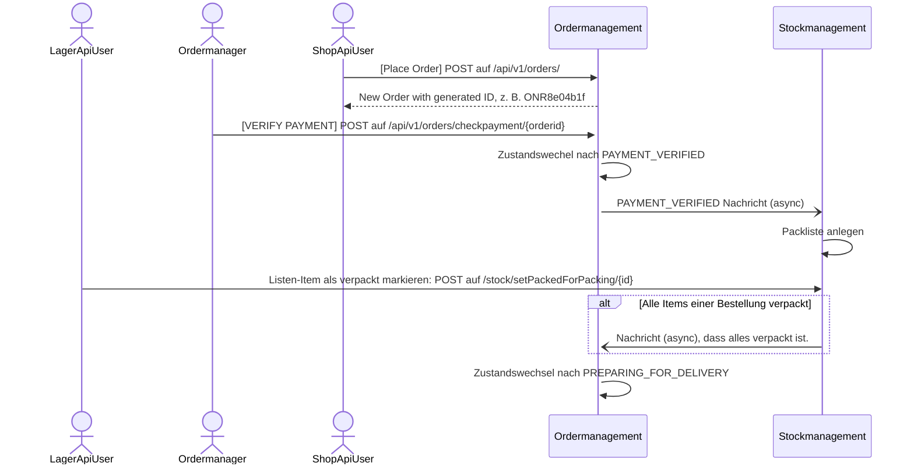
```mermaid
sequenceDiagram
actor LagerApiUser
actor Ordermanager
actor ShopApiUser
ShopApiUser->>Ordermanagement: [Place Order] POST auf /api/v1/orders/
Ordermanagement-->>ShopApiUser: New Order with generated ID, z. B. ONR8e04b1f
Ordermanager->>+Ordermanagement: [VERIFY PAYMENT] POST auf /api/v1/orders/checkpayment/{orderid}
Ordermanagement->>Ordermanagement: Zustandswechel nach PAYMENT_VERIFIED
Ordermanagement-)Stockmanagement: PAYMENT_VERIFIED Nachricht (async)
Stockmanagement->>Stockmanagement: Packliste anlegen
LagerApiUser->>Stockmanagement: Listen-Item als verpackt markieren: POST auf /stock/setPackedForPacking/{id}
 alt Alle Items einer Bestellung verpackt
       Stockmanagement-)Ordermanagement: Nachricht (async), dass alles verpackt ist.
 end
Ordermanagement ->>+Ordermanagement: Zustandswechsel nach PREPARING_FOR_DELIVERY
```

Dokumentation (texthelle Beschreibung, Codeauszüge, C4-Diagramme, Klassendiagramme) der Ports-Und-Adapters-Architektur und der DDD-Bestandteile (taktische Muster) von Ordermanagement anhand der gegebenen Anwendungsfälle, die schon implementiert sind:
### Bestellung aufgeben
über den Rest-Controller wird ein POST auf orders gemacht                                              
```java
//OrderRestController.java
//der JSON wird als PlaceOrderCommand übergeben
//ein PlaceOrderCommand wird benötigt, dass alle wissen, wie so ein Order aussehen muss, ohne Abhängigkeiten zu Ordermanagement herzustellen
@PostMapping("/orders/")
public ResponseEntity placeNewOrder(@RequestBody @Valid PlaceOrderCommand placeOrderCommand, BindingResult bindingResult) {
    Logger.getLogger(this.getClass().getName()).log(Level.INFO, "Handling place new order api request ...");

    HashMap<String, String> errors = new HashMap<>();

    if (bindingResult.hasErrors()) {
        Logger.getLogger(this.getClass().getName()).log(Level.WARNING, "Errors in placeOrderCommand detected!");
        for (FieldError fieldError : bindingResult.getFieldErrors()) {
            errors.put(fieldError.getField(), fieldError.getDefaultMessage());
        }
        throw new OrderPlacedFieldValidationException("Validation errors for order placement!", errors);
    }

    //über Servicelayer wird das neue Order in handle gemappt mit den richtigen Typen und ein Order gebaut
    OrderResponse orderResponse = orderCommandService.handle(placeOrderCommand);

    String resourceLocation = ServletUriComponentsBuilder.fromCurrentContextPath().build().toUriString() + "/orders/" + orderResponse.orderID();
    try {
        //GET Request mit OrderID aus OrderResponse
        //Ergebnis wird an den aufrufenden Client zurückgesendet
        return ResponseEntity.created(new URI(resourceLocation)).body(orderResponse);
    } catch (URISyntaxException e) {
        return ResponseEntity.noContent().build();
    }
}
```  
```java
//OrderCommandServiceImpl.java
@Transactional
public OrderResponse handle(PlaceOrderCommand placeOrderCommand) {
    /**Code ausgelassen**/
    //LineItems von CartItem aus PlaceOrderCommand erstellen
    List<LineItem> lineItemList = new ArrayList<>();
    int i = 1;
    for (CartItem cartItem : placeOrderCommand.cartItems()) {
        lineItemList.add(new LineItem(
                        new OrderPosition(i),
                        new ProductNumber(cartItem.productNumber()),
                        new Name(cartItem.productName()),
                        new MonetaryAmount(new BigDecimal(cartItem.priceNet())),
                        new Percentage(cartItem.tax()),
                        new Amount(cartItem.amount())
                )
        );
        i++;
    }

    //Order aus PlaceOrderCommand bauen
    Order orderToInsert = new Order(
            new OrderID("ONR" + UUID.randomUUID().toString().substring(0, 7)),
            new CustomerData(
                    new CustomerID(placeOrderCommand.customerID()),
                    new Name(placeOrderCommand.customerFirstname()),
                    new Name(placeOrderCommand.customerLastname()),
                    new Email(placeOrderCommand.customerEmail()),
                    placeOrderCommand.customerStreet(),
                    placeOrderCommand.customerZipcode(),
                    placeOrderCommand.customerCity(),
                    placeOrderCommand.customerCountry()
            ),
            LocalDateTime.now(),
            lineItemList,
            OrderState.PLACED
    );

    //über das Repository wird das Order eingefügt und bekommt die fertige Order als Optional zurück
    Optional<Order> orderOptional = this.orderRepository.insert(orderToInsert);

    if (orderOptional.isPresent()) {
        Logger.getLogger(this.getClass().getName()).log(Level.INFO, "Publishing order placed domain event ...");
        //Event wird getriggert (über Port OrderOutgoingMessageRelay), dass Order erstellt wurde und auch der Inhalt der Order wird ausgegeben
        orderOutgoingMessageRelay.publish(new OrderPlacedEvent(OrderResponseMapper.toResponseFromDomain(orderOptional.get())));
        //aus Order wird eine OrderResponse gemappt, diese an den aufrufenden REST-Controller zurückgeliefert
        return OrderResponseMapper.toResponseFromDomain(orderOptional.get());
    } else {
        throw new OrderPlacementNotSuccessfullException("OrderQueryServiceImpl: Order could not be placed!");
    }
}
``` 
### Bestellung auf bezahlt setzen
```java
//OrderRestController.java

//im Rest-Controller wird auf checkPayment mit OrderID
@PostMapping("/orders/checkpayment/{orderid}")
public ResponseEntity validatePaymentForOrderWithId(@PathVariable String orderid) {
    Logger.getLogger(this.getClass().getName()).log(Level.INFO, "Handling check payment for order api request ...");

    //über Servicelayer wird an handle als OrderPaymentCheckCommand übergeben
    this.orderCommandService.handle(new OrderPaymentCheckCommand(orderid));
    //aufrufender Client bekommt ein Accepted zurück
    return ResponseEntity.accepted().body("Order payment check executed. Order payment ok!");
}
```
```java
@Override
@Transactional
public void handle(OrderPaymentCheckCommand orderPaymentCheckCommand) throws OrderPaymentCheckFailedException {
    /**Code ausgelassen**/
    //Order über Repository aus DB holen mit OrderID
    Optional<Order> optionalOrderToCheck = this.orderRepository.getById(new OrderID(orderPaymentCheckCommand.orderID()));
    if (optionalOrderToCheck.isPresent()) {
        //Order aus dem Optional holen
        Order order = optionalOrderToCheck.get();
        try { //versuchen, den State zu verändern
            order.orderStateTransitionTo(OrderState.PAYMENT_VERIFIED);
            //State auch in der DB aktualisieren
            this.orderRepository.updateOrderWithNewState(order);
            //Event getriggert, dass Payment verifiziert ist, mit OrderResponseMapper in OrderResponse mappen
            this.orderOutgoingMessageRelay.publish(new OrderPaymentValidatedEvent(OrderResponseMapper.toResponseFromDomain(order)));
            Logger.getLogger(this.getClass().getName()).log(Level.INFO, "Payment validated event published!");
        } catch (OrderStateChangeNotPossibleException orderStateChangeNotPossibleException) {
            throw new OrderPaymentCheckFailedException("Order payment check not possible. Order in wrong state! " + orderStateChangeNotPossibleException.getMessage());
        }
    } else {
        throw new OrderPaymentCheckFailedException("Order with Id " + orderPaymentCheckCommand.orderID() + " not found for payment check!");
    }
}
```
### Packliste generieren
```java
//PackingRestController.java
//Packing List für ein spezielles Order abrufen
@GetMapping("/packings/whithorderid/{ordernr}")
public ResponseEntity<Packing> getPackingByOrderNr(@PathVariable String ordernr) {
    //über Repository werden die PackingItems geholt und in Packing in Liste eingefügt
    Packing p = this.packingRepository.findByOrderId(ordernr);
    if (p != null) {
        return ResponseEntity.ok(p);
    } else {
        return ResponseEntity.notFound().build();
    }
}
```
```java
//StockIncomingMessageHandler.java
//wenn Payment Verifizierung erfolgreich, wird Event von OrderOutgoingSpringMessageRelayImpl veröffentlicht
//diese wird von StockIncomingMessageHandler erkannt und erstellt dann ein Packing und die PackingItemList
public void onApplicationEvent(OrderPaymentValidatedSpringEvent event) {
Logger.getLogger(this.getClass().getName()).log(Level.INFO, "Handling order payment validated spring event ...");

//aus dem Event die OrderResponse holen
OrderResponse orderResponse = event.getOrderResponse();

//leeres Packing erstellen
Packing packingToSaveToDb =
        Packing.builder()
                .id(null)
                .orderId(orderResponse.orderID())
                .deliveryData(new DeliveryData(
                                orderResponse.customerFirstname() + " " + orderResponse.customerLastname(),
                                orderResponse.customerStreet(),
                                orderResponse.customerZipcode(),
                                orderResponse.customerCity(),
                                orderResponse.customerCountry()
                        )
                ).packingItemList(null) // List is generated down under
                .build();

//PackingItemList in leerem Packing mit den Werten aus OrderResponse befüllen
List<PackingItem> packingItemList = new ArrayList<>();
for (LineItemResponse lineItemResponse : orderResponse.orderLineItems()) {
    packingItemList.add(
            new PackingItem(
                    null,
                    lineItemResponse.productNumber(),
                    lineItemResponse.productName(),
                    lineItemResponse.amount(),
                    false,
                    packingToSaveToDb
            )
    );
}
//PackingItemList setzen
packingToSaveToDb.setPackingItemList(packingItemList);
//Packing über Repository speichern
this.packingRepository.save(packingToSaveToDb);
Logger.getLogger(this.getClass().getName()).log(Level.INFO, "New packing list created and saved in db ...");
}
```
### Packlistenitems abhaken
```java
//PackingRestController.java
//Über PackingItemId wird PackingItem in Packing als verpackt gesetzt
@PostMapping("/setPackedForPacking/{packingItemId}")
public void setPackingItemPackedForPacking(@PathVariable Long packingItemId) {
Logger.getLogger(this.getClass().getName()).log(Level.INFO, "Handling packing for item# " + packingItemId);

//PackingItem mit Repository herausholen
Optional<PackingItem> optionalPackingItem = this.packingItemRepository.findById(packingItemId);
if (optionalPackingItem.isPresent()) {
    PackingItem packingItem = optionalPackingItem.get();
    //Packed auf true setzen
    packingItem.setPacked(true);
    //PackingItem über Repository wieder speichern
    packingItemRepository.save(packingItem);

    
    Long packingId = packingItem.getPacking().getId();
    //Packing des PackingItem holen
    Optional<Packing> packing = this.packingRepository.findById(packingId);

    boolean allpaked = true;
    for (PackingItem item : packing.get().getPackingItemList()) { //alle PackingItems prüfen, ob sie packed sind
        if (!item.isPacked()) allpaked = false;
    }

    if (allpaked) {//wenn alle verpackt sind
        Logger.getLogger(this.getClass().getName()).log(Level.INFO, "All items for order# " + packing.get().getOrderId() + "packed. Publishing event ...");
        this.stockMessagePublisher.publishOrderPackedSpringEventForOrderId(packing.get().getOrderId()); //Event (OrderPackedEvent) veröffentlichen, dass Packing fertig ist
    }
}
}
```
### Bestellung auf IN_DELIVERY setzen wenn alle Packlistenitems gepackt sind
```java
//Event OrderPackedEvent wurde veröffentlicht und triggert nun diesen Methodenaufruf
@Transactional
public void handle(OrderPackedEvent orderPackedEvent) {
    //Meterialize object into Memory, place changes, and forward the domain object to repository
    //this ensures, that businesslogic will be executed und object is in consistent state.
    Logger.getLogger(this.getClass().getName()).log(Level.INFO, "Handling order packed event ...");

    //Über Repository die Order holen, OrderID aus OrderPackedEvent bekommen
    Optional<Order> optionalOrderToCheck = this.orderRepository.getById(orderPackedEvent.orderId());
    if (optionalOrderToCheck.isPresent()) {
        Order order = optionalOrderToCheck.get();
        try {

            //State der Order auf PREAPRING_FOR_DELIVERY
            order.orderStateTransitionTo(OrderState.PREPARING_FOR_DELIVERY);
            //Order updaten
            this.orderRepository.updateOrderWithNewState(order);
            Logger.getLogger(this.getClass().getName()).log(Level.INFO, "Order state changed to preparing_for_delivery, changed order persisted!");
        } catch (OrderStateChangeNotPossibleException orderStateChangeNotPossibleException) {
            throw new OrderPaymentCheckFailedException("Order state change to preparing for delivery not possible! " + orderStateChangeNotPossibleException.getMessage());
        }
    } else {
        throw new OrderWithGivenIDNotFoundException("Order with Id " + orderPackedEvent.orderId().id() + " not found for state change to preparing for delivery!");
    }

}
```
### Wo findet man DDD-Bestandteile?
in Ordermanagement sind
#### Value Objects
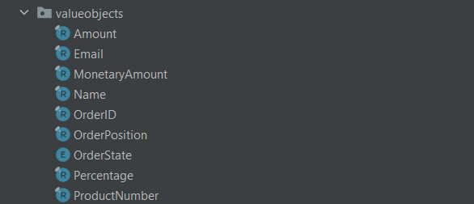
```java
//Beispiel Amount
@ValueObjectMarker
public record Amount(int amount) {
    public Amount {
        if (!isValid(amount)) throw new IllegalArgumentException("Amount must not be positive integer!");
    }

    public static boolean isValid(int amount) {
        return amount >= 0;
    }
}
```
##### Aggregates
```java
@AggregateMarker
public final class Order {

    //ID
    private final OrderID orderID;

    //Customer-Data
    private CustomerData customerData;

    //Line-Items
    private final List<LineItem> lineItems;

    //Order-State and calcuated values
    private OrderState state;
    private final MonetaryAmount taxTotal;
    private final MonetaryAmount netTotal;
    private final MonetaryAmount grossTotal;
    private final LocalDateTime date;

    public Order(OrderID orderID, CustomerData customerData,
                 LocalDateTime date, List<LineItem> lineItems, OrderState status) {
        if (orderID == null) throw new IllegalArgumentException("OrderID must not be null!");
        this.orderID = orderID;
        if (customerData == null)
            throw new IllegalArgumentException("Customer-Data for order invalid!");
        this.customerData = customerData;
        if (lineItems == null)
            throw new IllegalArgumentException("LineItems-List must not be null, at least an empy List is needed!");
        this.lineItems = lineItems;
        if (status == null) throw new IllegalArgumentException("State must not be null!");
        this.state = status;
        this.taxTotal = this.calculateOrderTax();
        this.netTotal = this.calculateOrderNetTotal();
        this.grossTotal = this.calculateOrderGrossTotal();
        this.date = date;
    }

    public List<LineItem> getLineItems() {
        return Collections.unmodifiableList(this.lineItems);
    }

    public void orderStateTransitionTo(OrderState newState) {
        switch (newState) {
            case CANCELED -> {
                if (this.state == OrderState.IN_DELIVERY || this.state == OrderState.DELIVERED)
                    throw new OrderStateChangeNotPossibleException("Order in State " + this.state + " cannot be canceled");
                this.state = newState;
            }
            case PAYMENT_VERIFIED -> {
                if (this.state != OrderState.PLACED)
                    throw new OrderStateChangeNotPossibleException("Order must be in state PLACED for transition to PAYMENT VERIFIED!");
                this.state = newState;
            }
            case PREPARING_FOR_DELIVERY -> {
                if (this.state != OrderState.PAYMENT_VERIFIED)
                    throw new OrderStateChangeNotPossibleException("Order must be in state PAYMENT VERIFED for transition to PREPARING FOR DELIVERY!");
                this.state = newState;
            }
            case IN_DELIVERY -> {
                if (this.state != OrderState.PREPARING_FOR_DELIVERY)
                    throw new OrderStateChangeNotPossibleException("Order must be in state PREPARING FOR DELIVERY for transition to IN DELIVERY!");
                this.state = newState;
            }
            case DELIVERED -> {
                if (this.state != OrderState.IN_DELIVERY)
                    throw new OrderStateChangeNotPossibleException("Order must be in state IN DELIVERY for transition to DELIVERED!");
                this.state = newState;
            }
        }
    }
    /**Code ausgelassen**/

}
```
#### Repositories
```java
@RepositoryMarker
@Repository
class OrderRepositoryImpl implements OrderRepository {

    @Autowired
    private OrderJPARepository orderJPARepository;

    @Override
    public Optional<Order> insert(Order order) {
        if (order == null) throw new IllegalArgumentException("Order to be inserted must not be null!");
        OrderDbEntity orderDbEntity = DbOrderMapperService.toOrm(order);
        OrderDbEntity insertedEntity = orderJPARepository.save(orderDbEntity);
        if (insertedEntity == null) return Optional.empty();
        return Optional.of(DbOrderMapperService.toDomain(insertedEntity));
    }

    @Override
    public Optional<Order> getById(OrderID id) {
        if (id == null) throw new IllegalArgumentException("OrderID for Order to get from db must not be null!");
        Optional<OrderDbEntity> orderEntityOptional = this.orderJPARepository.findById(id.id());
        if (!orderEntityOptional.isPresent()) return Optional.empty();
        return Optional.of(DbOrderMapperService.toDomain(orderEntityOptional.get()));
    }

    @Override
    public List<Order> getAll() {
        List<OrderDbEntity> list = this.orderJPARepository.findAll();
        if (list == null) return Collections.emptyList();
        return list.stream().map(dbEntity -> DbOrderMapperService.toDomain(dbEntity)).toList();
    }

    @Override
    public void deleteById(OrderID id) {
        this.orderJPARepository.deleteById(id.id());
    }

    /**Code ausgelassen**/
}
```
#### Events zwischen Aggregate
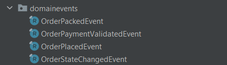
```java
@Service
@AllArgsConstructor
class IncomingOrderPackedSpringEventHandler implements ApplicationListener<OrderPackedSpringEvent> {

    private OrderIncomingMessagesPort orderIncomingMessagesPort;

    @Override
    @Async("threadPoolTaskExecutor")
    public void onApplicationEvent(OrderPackedSpringEvent event) {
        Logger.getLogger(this.getClass().getName()).log(Level.INFO, "Order packed event received for order# " + event.getOrderID());
        this.orderIncomingMessagesPort.handle(new OrderPackedEvent(new OrderID(event.getOrderID())));
    }
}
```
### Wo findet man Ports-Und-Adapters-Architektur?
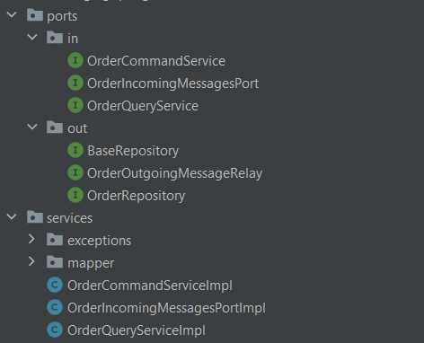
- die Ports sind die Interfaces
- die Adapter sind die zugehörigen Implementierungen
- es gibt mehrere Schichten: Domäne, Service, Infrastructure
- wenn sich die Technologie bei einem Adapter verändert, hat dies keine Auswirkungen auf das restliche System; diese Änderung kann einfach implementiert werden

## Dokumentation (texthelle Beschreibung, Codeauszüge, Diagramme, C4-Diagramme, Klassendiagramme) der "Architektur" von Stockmanagement anhand der gegebenen Anwendungsfälle, die schon implementiert sind:
- Packingliste anlegen
- Packingitems als verpackt markieren

Ist eine Art der 3-Schichten-Architektur mit Events und Ports
- Rest Controller verwendet direkt Repository (package db) über Port
- Rest Controller published Events
- diese Events werden von den Listeners dann aufgefangen und verarbeitet
- in package business liegen die Entitäten ohne Businesslogik
- nur über die Events sind die verschiedenen Managements verbunden und über den sharedkernel (dort ist alles enthalten, damit die Kommunikation erfolgreich ist)
  
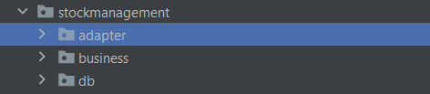


C4-Diagramm

Context-Diagramm:
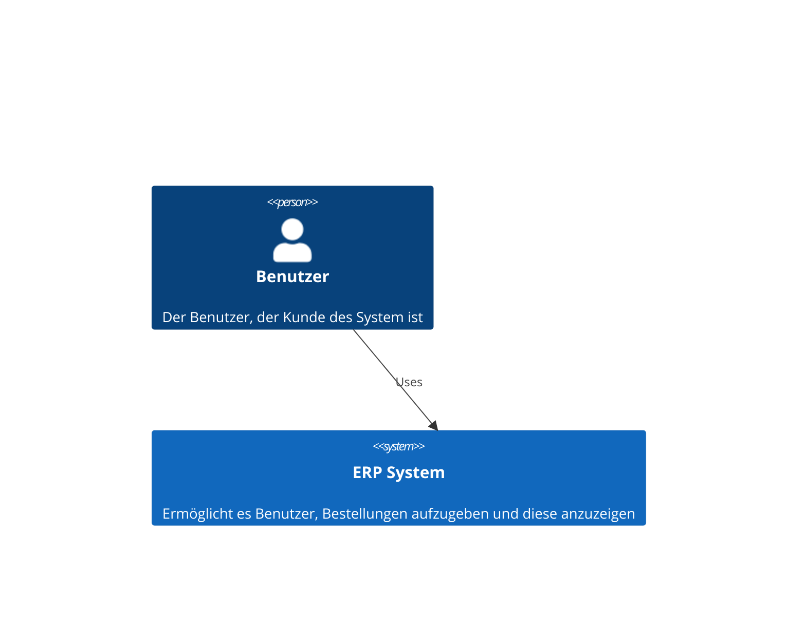
```mermaid
C4Context
        Person(user, "Benutzer", "Der Benutzer, der Kunde des System ist ")
        System(erp, "ERP System", "Ermöglicht es Benutzer, Bestellungen aufzugeben und diese anzuzeigen")
        Rel(user, erp, "Uses")
        UpdateLayoutConfig($c4ShapeInRow="1", $c4BoundaryInRow="1")
```

Container-Diagramm:
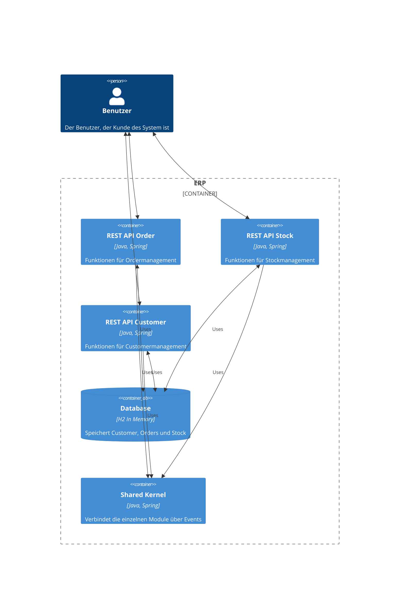
```mermaid
C4Container
    Person(user, "Benutzer", "Der Benutzer, der Kunde des System ist ")
    Container_Boundary(c1, "ERP") {
        Container(restapi1, "REST API Order", "Java, Spring", "Funktionen für Ordermanagement")
        Container(restapi2, "REST API Stock", "Java, Spring", "Funktionen für Stockmanagement")
        Container(restapi3, "REST API Customer", "Java, Spring", "Funktionen für Customermanagement")
        ContainerDb(database, "Database", "H2 In Memory", "Speichert Customer, Orders und Stock")
        Container(sharedkernel, "Shared Kernel", "Java, Spring", "Verbindet die einzelnen Module über Events")

    }

    BiRel(database, restapi1, "Uses")
    BiRel(database, restapi2, "Uses")
    BiRel(database, restapi3, "Uses")
    Rel(restapi1, sharedkernel, "Uses")
    Rel(restapi2, sharedkernel, "Uses")
    Rel(restapi3, sharedkernel, "Uses")
    BiRel(user,restapi1, "")
    BiRel(user,restapi2,  "")
    BiRel(user,restapi3,  "")
    UpdateLayoutConfig($c4ShapeInRow="3", $c4BoundaryInRow="1")
```
Component-Diagramm Ordermanagement:
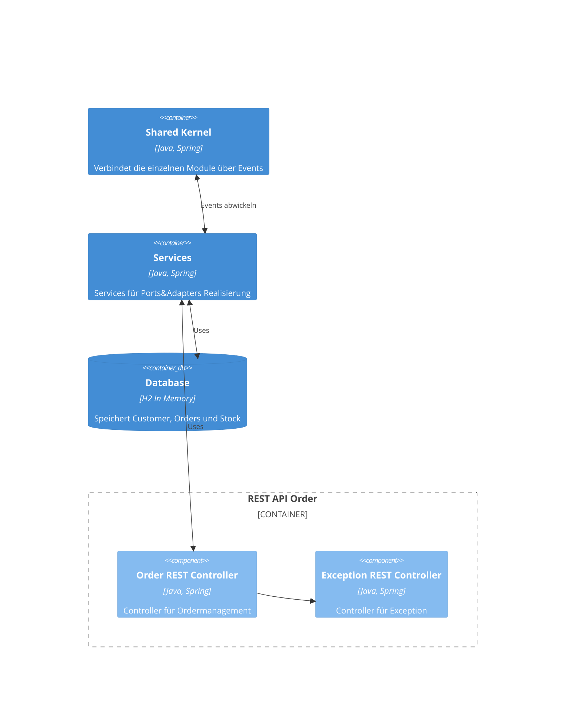
```mermaid
C4Component
    Container_Boundary(c1, "REST API Order") {
        Component(restapi1, "Order REST Controller", "Java, Spring", "Controller für Ordermanagement")
        Component(restapi2, "Exception REST Controller", "Java, Spring", "Controller für Exception")
    }
    Container(sharedkernel, "Shared Kernel", "Java, Spring", "Verbindet die einzelnen Module über Events")
    Container(services, "Services", "Java, Spring", "Services für Ports&Adapters Realisierung")
    ContainerDb(database, "Database", "H2 In Memory", "Speichert Customer, Orders und Stock")

    BiRel(database, services, "Uses")
    BiRel(services, restapi1, "Uses")
    BiRel(services, sharedkernel, "Events abwickeln")
    Rel(restapi1, restapi2, "")
    UpdateLayoutConfig($c4ShapeInRow="3", $c4BoundaryInRow="1")
```

Component-Diagramm Stockmanagement:
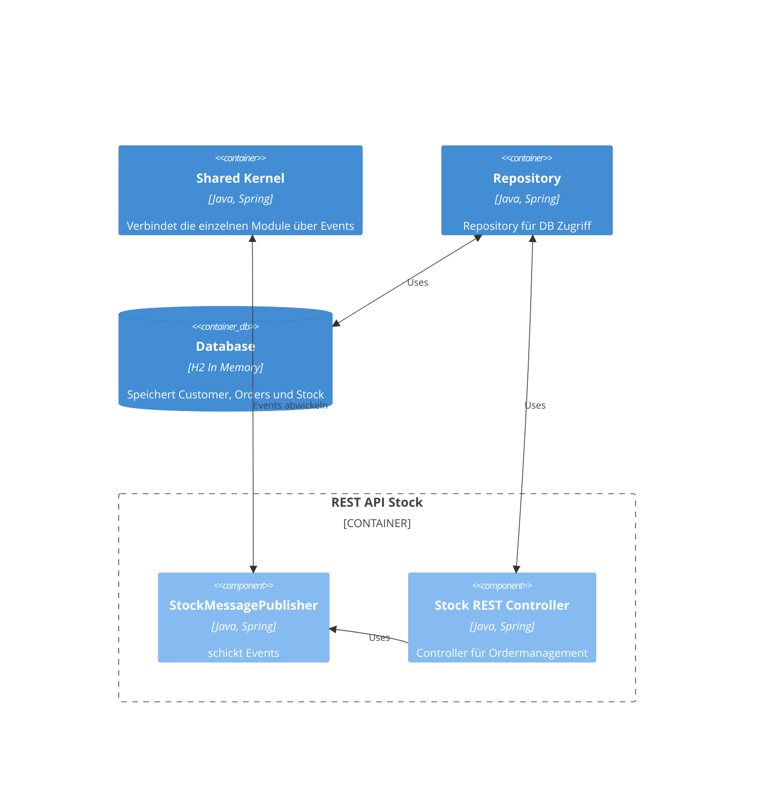
```mermaid
C4Component
    Container_Boundary(c1, "REST API Stock") {
        Component(publish, "StockMessagePublisher", "Java, Spring", "schickt Events")
        Component(restapi1, "Stock REST Controller", "Java, Spring", "Controller für Ordermanagement")

    }
    Container(sharedkernel, "Shared Kernel", "Java, Spring", "Verbindet die einzelnen Module über Events")
    Container(repo, "Repository", "Java, Spring", "Repository für DB Zugriff")
    ContainerDb(database, "Database", "H2 In Memory", "Speichert Customer, Orders und Stock")

    BiRel(database, repo, "Uses")
    BiRel(repo, restapi1, "Uses")
    BiRel(publish, sharedkernel, "Events abwickeln")
    Rel(restapi1, publish, "Uses")
    UpdateLayoutConfig($c4ShapeInRow="3", $c4BoundaryInRow="1")
```
Klassendiagramm des Ordermanagement:
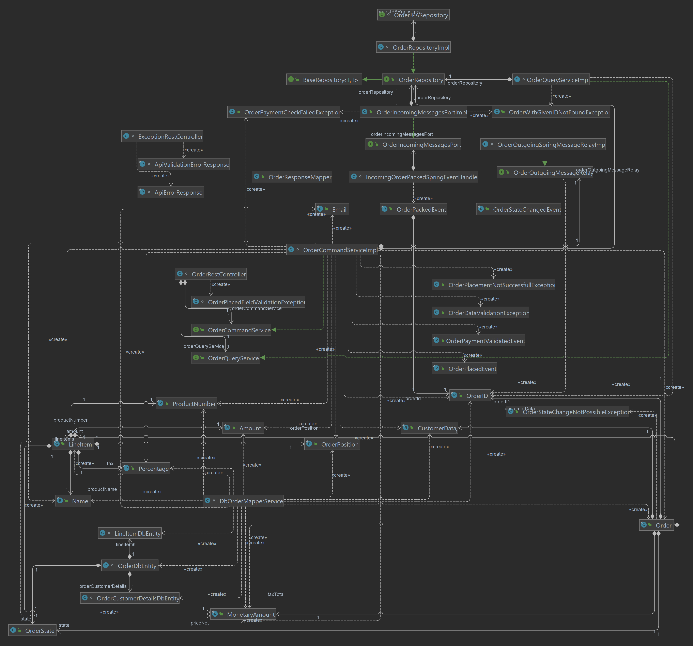

Klassendiagramm des Stockmanagement:
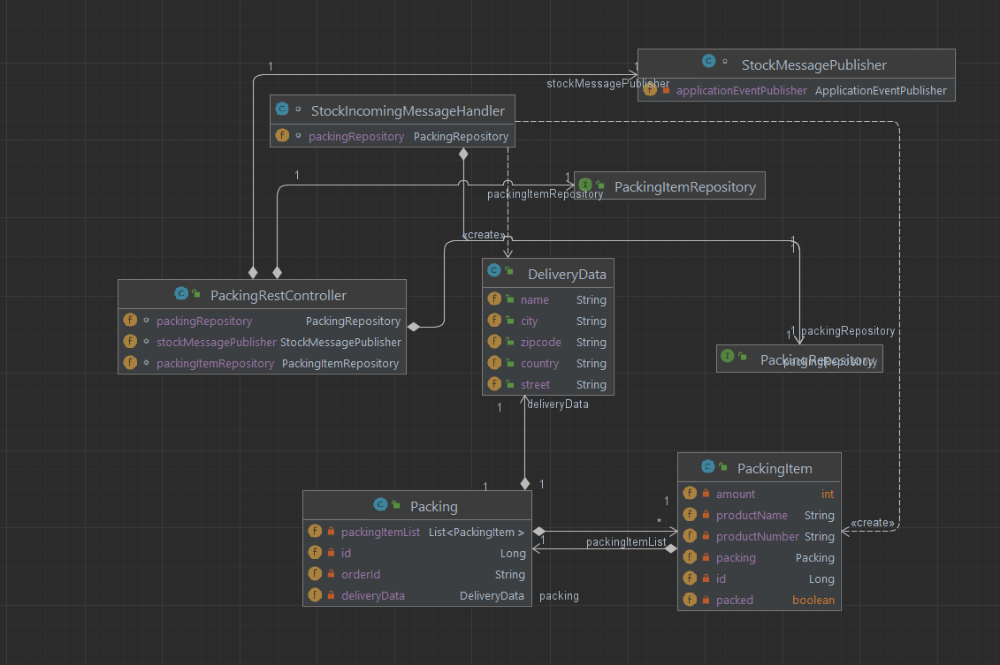


# Aufgabe Makroarchitektur Teil 3 (Microservices)
## Inbetriebnahme der Microservice-Variante von erplite
als Schritt für Schritt-Anleitung mit Screenshots und Text zu dokumentieren

Zuerst müssen die benötigten Docker Instanzen hochgefahren werden, denn diese werden von den einzelnen Programmen genutzt wie zum Beispiel MySql als Datenbank und Rabbitmq als Messenger.

Danach werden die einzelnen Projekte in einem Intellij Projekt zusammengefasst. 

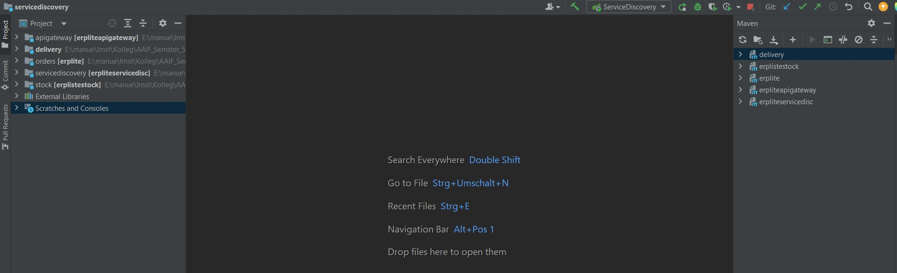

Anschließend müssen die Projekte einzeln gestartet werden. Hierbei ist zu beachten, dass das Projekt servicediscovery als erstes gestartet werden.
Nachdem sollte dies wie folgt aussehen:

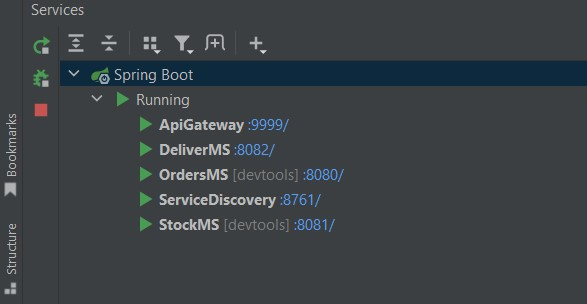

Das Frontend wird in Visual Studio Code geöffnet. 

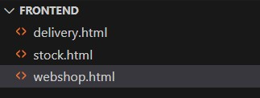

Das Frontend wird mit einem Webserver auf dem Port 5500 ausgeführt und sieht im Browser wie folgt aus:

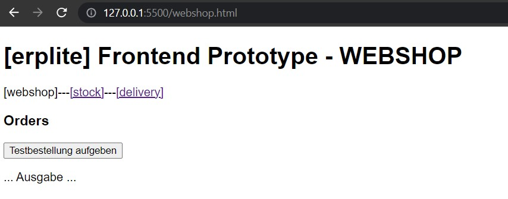

Weiters kann kontrolliert werden, ob die Microservices erfolgreich eingecheckt worden sind.

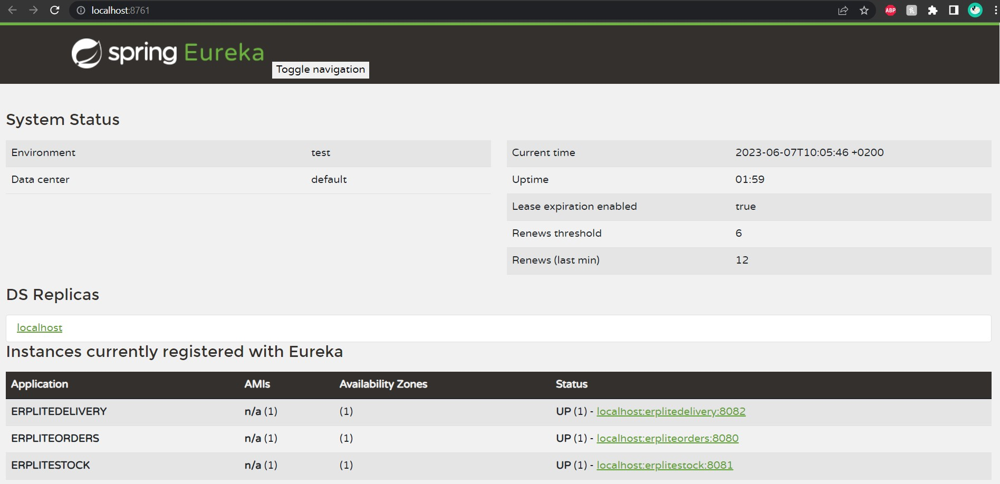

Nun kann die Applikation genutzt werden.

## Abgabe einer Architekturanalyse des bestehenden erplitems-Backends

### Schriftliche Dokumentation der Architektur als C4-Containerdiagramm und C4-Componentendiagramm incl. textuellen Beschreibungen, Codeauszügen und Screenshots.

Kurz und Knapp:
Der OrderMS baut auf der Ports and Adapters Struktur auf. Gehen wird davon das, dass eine neue Order erstellt wird. Dabei geht ein Post-Request an den Rest-Controller ein und die entsprechende Funktion mit dem richtigen Mapping kümmert sich darum. Diese empfängt als Parameter eine PlaceOrderCommand. Der Body wird automatisch von Spring in ein solches PlaceOrderCommand gemappt. 

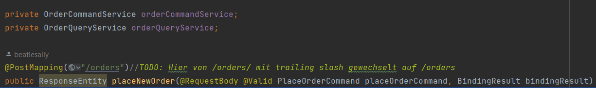

Das PlaceOrderCommand beinhaltet Datenfelder wie die Order-Domäne, jedoch sind alle als Typ String um eine geringe Kopplung zu erzielen. Außerdem enthält dieser Command nur die Datenfelder, die nicht automatisch vom System generiert werden.

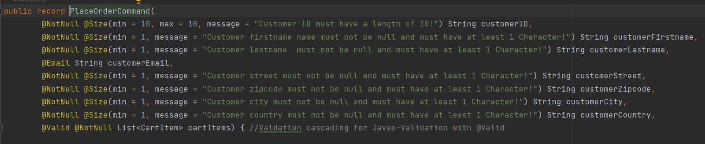

Ein Beispiel beim PlaceOrderCommand ist die OrderID, diese ist nicht enthalten, da sie beim Handling dieses Commands im OrderCommandService generiert wird. Dieser PlaceOrderCommand sowie andere Commands werden in OrderCommandService handelt. Die handle-Methode wird überladen, indem sie Parameter von verschiedenen Commands enthält. Somit weiß man, auf welchen Command reagiert wird, da die verschiedenen Commands verschiedene Zwecke erfüllen. 

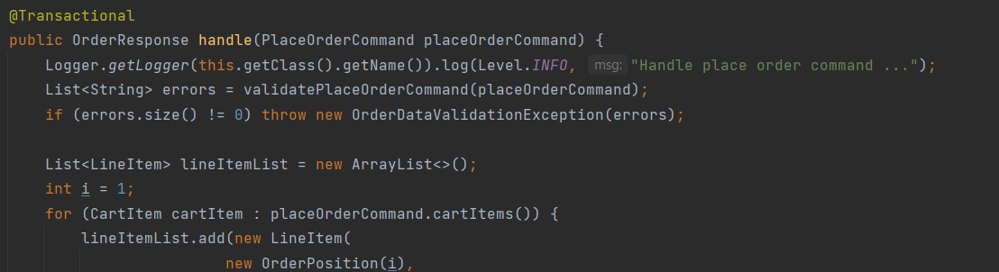

Der OrderCommandService verwendet den Port OrderOutgoingMessageRelay und das OrderRepository. 

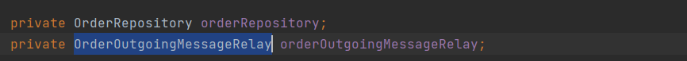

Somit ist klar, dass man sich mit dem OrderCommandService im Servicelayer befindet und dieser über die Ports die Datenbank und das RabbitMQ Messaging verwendet. Nachdem aus dem PlaceOrderCommand ein Order-Objekt erstellt wurde, wird es über das Repository in die Datenbank geschrieben. Weiters wird ein Event veröffentlicht.
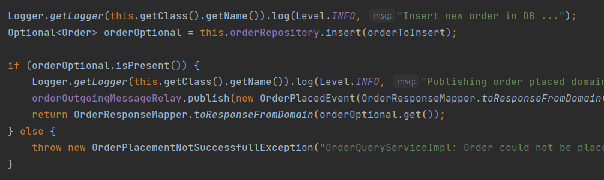

Für dieses ist beim Message Broker eine bestimmte Queue hinterlegt.

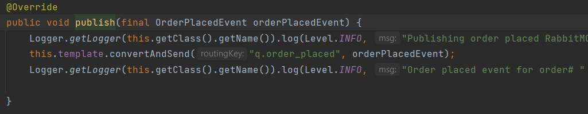

Als Message wird aus dem Order-Objekt ein OrderResponse-Objekt (ist ein DTO => somit keine Abhängigkeiten) gemappt. Ein OrderResponse kann man sich wie Command vorstellen. Zur besseren Orientierung und das wenig Missverständnisse auftauchen, wird zwischen Response und Command unterschieden. 

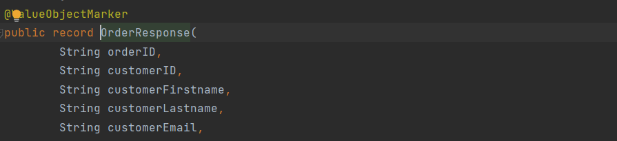

Sollte ein andere Microservice dieses Event abonniert haben, wird dieses im IncomingMessageRelay das neue Event erkennen und handeln. Es wird mit den Parameter die verschiedenen Events unterschieden dadurch die richtige Funktion ausgeführt, wenn auf eine Queue gehört wird wo mehrere verschiedene Events veröffentlicht werden. 

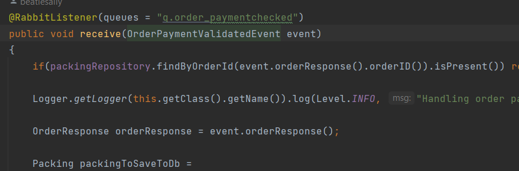

Diese beschriebene Vorgehensweise kann auf alle anderen Use-Cases angeführt werden, vielleicht in anderer Reihenfolge.


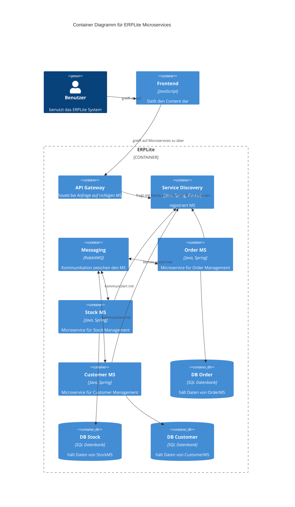
```mermaid
C4Container
    title Container Diagramm für ERPLite Microservices
    Person(customer, Benutzer, "benutzt das ERPLite System", $tags="v1.0")
    Container(frontend, "Frontend", "JavaScript", "Stellt den Content dar")

    Container_Boundary(c1, "ERPLite") {
        Container(apigw, "API Gateway", "routet bei Anfrage auf richtigen MS")
        Container(sd, "Service Discovery", "Java, Spring, Eureka", "registriert MS")
        Container(messaging, "Messaging", "RabbitMQ", "Kommunikation zwischen den MS")       
        Container(orderms, "Order MS", "Java, Spring", "Microservice für Order Management")
        Container(stockms, "Stock MS", "Java, Spring", "Microservice für Stock Management")
        Container(customerms, "Customer MS", "Java, Spring", "Microservice für Customer Management")
        ContainerDb(db_order, "DB Order", "SQL Datenbank", "hält Daten von OrderMS")
        ContainerDb(db_stock, "DB Stock", "SQL Datenbank", "hält Daten von StockMS")
        ContainerDb(db_customer, "DB Customer", "SQL Datenbank", "hält Daten von CustomerMS")
    }

    Rel(customer, frontend, "greift zu auf")
    Rel(frontend, apigw, "greift auf Microservices zu über")
    Rel(apigw, sd, "fragt mit Name an und erhält IP und Port von")
    Rel(orderms, db_order, "")
    Rel(stockms, db_stock, "")
    Rel(customerms, db_customer, "")
    BiRel(orderms, messaging, "kommuniziert mit")
    BiRel(stockms, messaging, "kommuniziert mit")
    BiRel(customerms, messaging, "kommuniziert mit")
    Rel(orderms, sd, "")
    Rel(customerms, sd, "")
    Rel(stockms, sd, "")

    UpdateLayoutConfig($c4ShapeInRow="3", $c4BoundaryInRow="1")
```

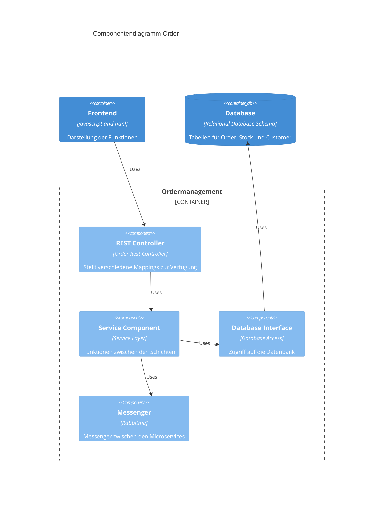
```mermaid
C4Component
    title Componentendiagramm Order
    Container(front, "Frontend", "javascript and html", "Darstellung der Funktionen")
    ContainerDb(db, "Database", "Relational Database Schema", "Tabellen für Order, Stock und Customer")

    Container_Boundary(order, "Ordermanagement") {
        Component(rest, "REST Controller", "Order Rest Controller", "Stellt verschiedene Mappings zur Verfügung")
        Component(service, "Service Component", "Service Layer", "Funktionen zwischen den Schichten")
        Component(dba, "Database Interface" "Database Access", "Zugriff auf die Datenbank")
        Component(msg, "Messenger" "Rabbitmq", "Messenger zwischen den Microservices")

    }
    Rel(front, rest, "Uses")
    Rel(rest, service, "Uses")
    Rel(service, dba, "Uses")
    Rel(service, msg, "Uses")
    Rel(dba, db, "Uses")

    UpdateRelStyle(front, rest, $offsetY="-40")
    UpdateLayoutConfig($c4ShapeInRow="3", $c4BoundaryInRow="1")
```

### Die beschriebenen Use-Cases (Bestellung anlegen, Payment verifizieren, Packlistenitems abhaken) entlang der Architektur beschreiben, Codeauszüge zeigen, Screenshots mit den Resultaten zeigen, textuelle Beschreibungen dazu
#### Bestellung anlegen
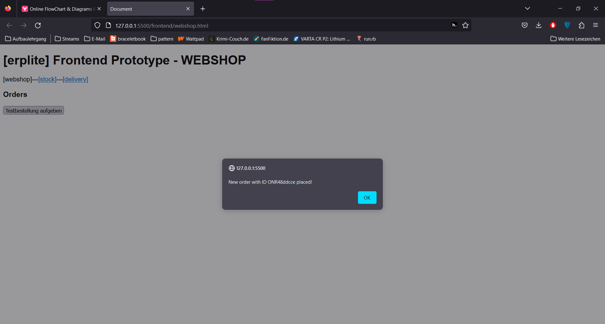

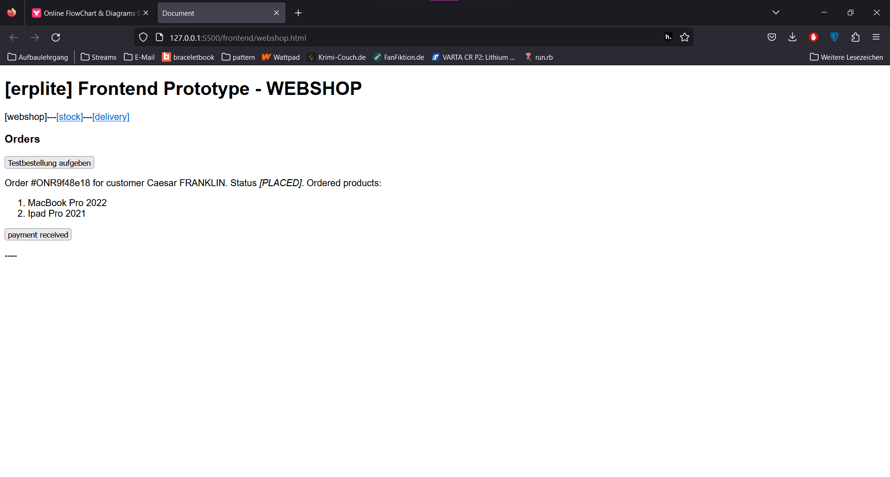

Als erstes wird mit einem POST Request auf api/v1/orders gemacht. Diese Anfrage geht an den ApiGateway. Dieser hat Routen definiert, die zu einer bestimmten URI führen. Somit kann man mit Namen anfragen und nicht mit einer IP. Die Route geht in diesem Fall auf den Microservice Orders. 

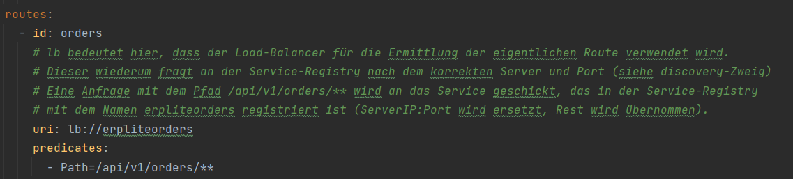

Im Body werden Dummydaten übergeben.
Danach wird die Funktion getallorders aufgerufen.
```javascript
async function putorder()
{
    const resp = await fetch('http://localhost:9999/api/v1/orders',{
        method:'POST',
        headers:{
            'Accept': 'application/json',
            'Content-Type': 'application/json'
        },
        body: `{
                    "customerID": "CUS1d34e56",
                    "customerFirstname": "Caesar",
                    "customerLastname": "Franklin",
                    "customerEmail": "a.b@c.de",
                    "customerStreet": "Hollywood Boulevard 2",
                    "customerZipcode" : "3452",
                    "customerCity" : "LA",
                    "customerCountry" : "USA",
                    "cartItems": [
                        {
                        "productNumber": "P123RE123D",
                        "productName" : "MacBook Pro 2022",
                        "priceNet" : 1000,
                        "tax" : 20,
                        "amount": 1
                        },
                        {
                        "productNumber": "O12345RE12",
                        "productName" : "Ipad Pro 2021",
                        "priceNet" : 99.99,
                        "tax" : 10,
                        "amount": 10
                        }
                    ]
                }`
    })
    const data = await resp.json()
    alert(`New order with ID ${data.orderID} placed!`)
    getallorders();
}
```
Im OrderRestController springt das Post-Mapping an. 

```java
 @PostMapping("/orders")//TODO: Hier von /orders/ mit trailing slash gewechselt auf /orders
    public ResponseEntity placeNewOrder(@RequestBody @Valid PlaceOrderCommand placeOrderCommand, BindingResult bindingResult) {

        Logger.getLogger(this.getClass().getName()).log(Level.INFO, "Handling place new order api request ...");

        HashMap<String, String> errors = new HashMap<>();

        if (bindingResult.hasErrors()) {
            Logger.getLogger(this.getClass().getName()).log(Level.WARNING, "Errors in placeOrderCommand detected!");
            for (FieldError fieldError : bindingResult.getFieldErrors()) {
                errors.put(fieldError.getField(), fieldError.getDefaultMessage());
            }
            throw new OrderPlacedFieldValidationException("Validation errors for order placement!", errors);
        }

        OrderResponse orderResponse = orderCommandService.handle(placeOrderCommand);

        String resourceLocation = ServletUriComponentsBuilder.fromCurrentContextPath().build().toUriString() + "/api/v1/orders/" + orderResponse.orderID();
        try {
            return ResponseEntity.created(new URI(resourceLocation)).body(orderResponse);
        } catch (URISyntaxException e) {
            return ResponseEntity.noContent().build();
        }
    }
```
```java
public record PlaceOrderCommand(
        @NotNull @Size(min = 10, max = 10, message = "Customer ID must have a length of 10!") String customerID,
        @NotNull @Size(min = 1, message = "Customer firstname name must not be null and must have at least 1 Character!") String customerFirstname,
        @NotNull @Size(min = 1, message = "Customer lastname  must not be null and must have at least 1 Character!") String customerLastname,
        @Email String customerEmail,
        @NotNull @Size(min = 1, message = "Customer street must not be null and must have at least 1 Character!") String customerStreet,
        @NotNull @Size(min = 1, message = "Customer zipcode must not be null and must have at least 1 Character!") String customerZipcode,
        @NotNull @Size(min = 1, message = "Customer city must not be null and must have at least 1 Character!") String customerCity,
        @NotNull @Size(min = 1, message = "Customer country must not be null and must have at least 1 Character!") String customerCountry,
        @Valid @NotNull List<CartItem> cartItems) { //Valdation cascading for Javax-Validation with @Valid
```
Der Body wird als PlacedOrderCommand gemappt, das im Shared Kernel definiert ist. Damit zwischen den Services keine Abhängigkeiten entstehen.

Über das ordercommandservice handelt die verschiedenen Commands die im Zusammenhang mit Order auftreten können. Das ordercommandservice verwendet orderrepository und das orderoutgoingmessagerelay.
```java
@Transactional
    public OrderResponse handle(PlaceOrderCommand placeOrderCommand) {
        Logger.getLogger(this.getClass().getName()).log(Level.INFO, "Handle place order command ...");
        List<String> errors = validatePlaceOrderCommand(placeOrderCommand);
        if (errors.size() != 0) throw new OrderDataValidationException(errors);

        /**aus dem PlaceOrderCommand wird eine Order gebastelt**/

        Logger.getLogger(this.getClass().getName()).log(Level.INFO, "Insert new order in DB ...");
        //Über Repository wird Order in die Datenbank eingetragen
        Optional<Order> orderOptional = this.orderRepository.insert(orderToInsert);

        if (orderOptional.isPresent()) {
            Logger.getLogger(this.getClass().getName()).log(Level.INFO, "Publishing order placed domain event ...");

            //wenn schreiben in die DB ok, dann Message gepublisht
            orderOutgoingMessageRelay.publish(new OrderPlacedEvent(OrderResponseMapper.toResponseFromDomain(orderOptional.get())));
            //es wird ein ein OrderResponse gemappt und an den REST Controller zurückgegebene
            return OrderResponseMapper.toResponseFromDomain(orderOptional.get());
        } else {
            throw new OrderPlacementNotSuccessfullException("OrderQueryServiceImpl: Order could not be placed!");
        }
    }
```
#### Payment verifizieren
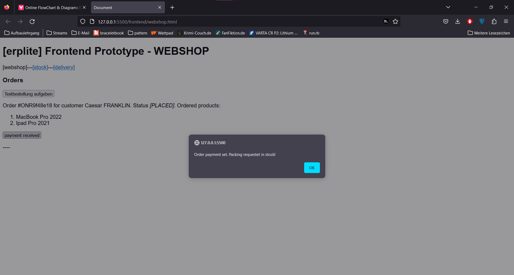

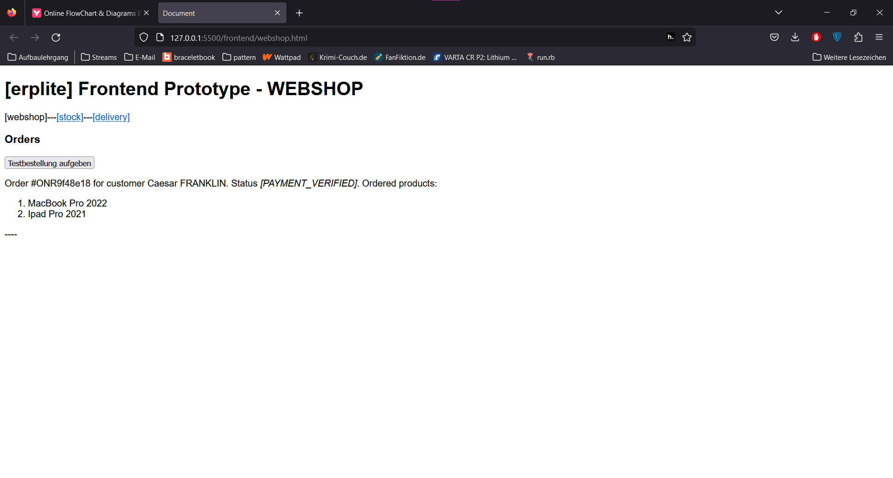
Es wird ein Post gesendet, mit der richtigen OrderID.
```javascript
 async function paymentok(orderid)
    {
      await fetch(
            `http://localhost:9999/api/v1/orders/checkpayment/${orderid}`,{
            method:'POST',
            headers:{
                'Accept': 'application/json',
                'Content-Type': 'application/json'
            }
        })
        alert("Order payment set. Packing requestet in stock!")
        getallorders();
    }
```
Dieser Post kommt beim OrderREstController an.
```java
@PostMapping("/orders/checkpayment/{orderid}")
    public ResponseEntity validatePaymentForOrderWithId(@PathVariable String orderid) {
        Logger.getLogger(this.getClass().getName()).log(Level.INFO, "Handling check payment for order api request ...");
        //das OrderCommand behandeln
        this.orderCommandService.handle(new OrderPaymentCheckCommand(orderid));
        return ResponseEntity.accepted().body("Order payment check executed. Order payment ok!");
    }
```
Über den ordercommandservice wird der OrderPaymentCheckCommand gehandlt.
```java
 @Transactional
    public void handle(OrderPaymentCheckCommand orderPaymentCheckCommand) throws OrderPaymentCheckFailedException {
        Logger.getLogger(this.getClass().getName()).log(Level.INFO, "Handling order payment check command ...");
        if (orderPaymentCheckCommand == null)
            throw new OrderPaymentCheckFailedException("Empty command for order payment check!");
        if (!OrderID.isValid(orderPaymentCheckCommand.orderID()))
            throw new OrderPaymentCheckFailedException("Order ID for order payment check not valid!");

        //mit dem OrderRepository wird das Order mit der ID aus der DB geholt
        Optional<Order> optionalOrderToCheck = this.orderRepository.getById(new OrderID(orderPaymentCheckCommand.orderID()));
        if (optionalOrderToCheck.isPresent()) {
            Order order = optionalOrderToCheck.get();
            try { // versuchen den Status des Orders zu ändern
                order.orderStateTransitionTo(OrderState.PAYMENT_VERIFIED);
                //Status wird geupdated
                this.orderRepository.updateOrderWithNewState(order);
                //Message wird erzeugt und gepublished
                this.orderOutgoingMessageRelay.publish(new OrderPaymentValidatedEvent(OrderResponseMapper.toResponseFromDomain(order)));
                Logger.getLogger(this.getClass().getName()).log(Level.INFO, "Payment validated event published!");
            } catch (OrderStateChangeNotPossibleException orderStateChangeNotPossibleException) {
                throw new OrderPaymentCheckFailedException("Order payment check not possible. Order in wrong state! " + orderStateChangeNotPossibleException.getMessage());
            }
        } else {
            throw new OrderPaymentCheckFailedException("Order with Id " + orderPaymentCheckCommand.orderID() + " not found for payment check!");
        }
    }
```
#### Packlistenitems abhaken
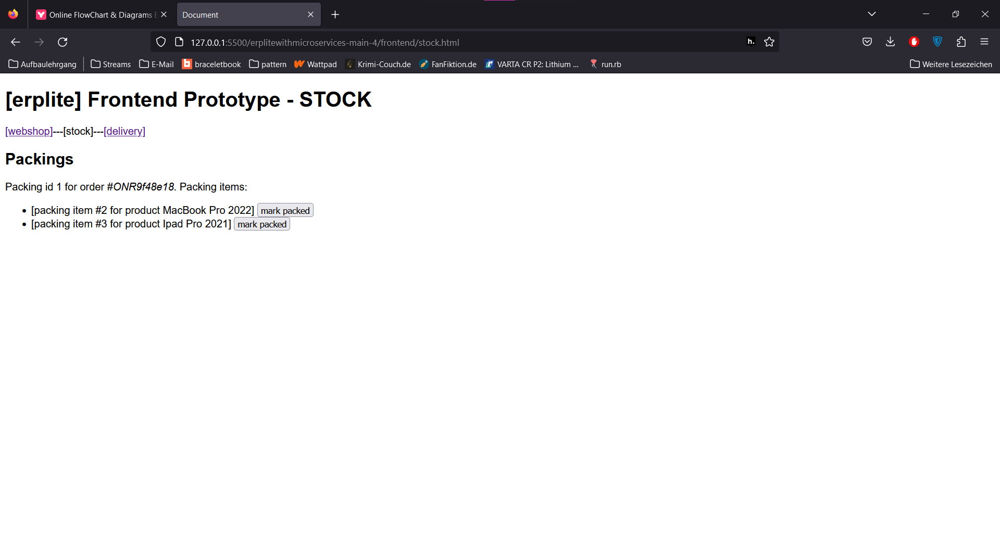

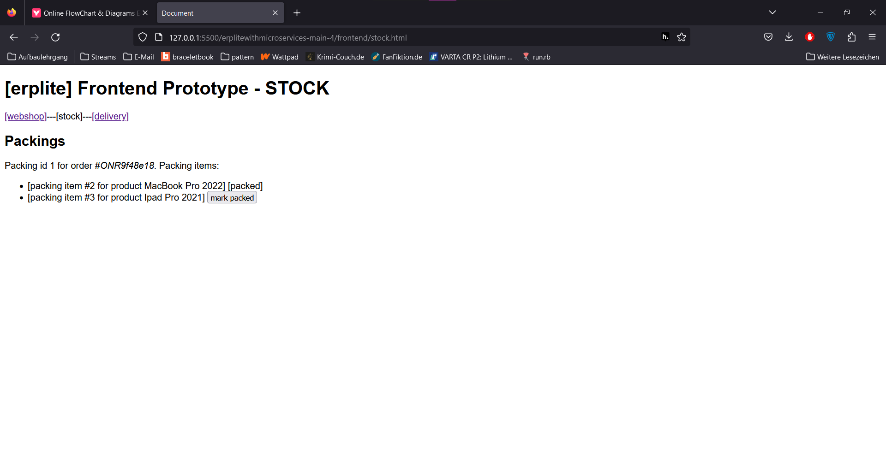

Jedes Paketitem wird einzeln als verpackt markiert. Das wird über die ItemID bestimmt.
```javascript
async function setpackedforpackingitem(packingitemid)
{
    await fetch(
        `http://localhost:9999/stock/setPackedForPacking/${packingitemid}`,{
        method:'POST',
        headers:{
            'Accept': 'application/json',
            'Content-Type': 'application/json'
        }
    })
    getallpackings()
}
```
Diese Anfrage geht auf dem RestController des StockMS ein.

```java
 @PostMapping("/setPackedForPacking/{packingItemId}")
    public ResponseEntity setPackingItemPackedForPacking(@PathVariable Long packingItemId) {
        Logger.getLogger(this.getClass().getName()).log(Level.INFO, "Handling packing for item# " + packingItemId);

        //holt sich das PackingItem über das Repository aus der DB
        Optional<PackingItem> optionalPackingItem = this.packingItemRepository.findById(packingItemId);

        if(!optionalPackingItem.isPresent())
        {
            Logger.getLogger(this.getClass().getName()).log(Level.INFO, "Packing for item# " + packingItemId + " not possible, item not present!");
            return ResponseEntity.badRequest().body("Packing for item# " + packingItemId + " not possible, item not present!");
        } else {
            PackingItem packingItem = optionalPackingItem.get();

            if(packingItem.isPacked())
            {
                Logger.getLogger(this.getClass().getName()).log(Level.INFO, "Packing for item# " + packingItemId + " not possible, item already packed!");
                return ResponseEntity.badRequest().body("Packing for item# " + packingItemId + " not possible, item already packed!");
            } else
            {
                //Item als verpackt setzen
                packingItem.setPacked(true);
                //Item wird über Repository in Daten gespeichert
                packingItemRepository.save(packingItem);

                Long packingId = packingItem.getPacking().getId();

                Optional<Packing> packing = this.packingRepository.findById(packingId);

                //check if all are packed, when one new item is packed (above) -> only works because we leave if item to pack that is already packed, see above
                boolean allpaked = true;
                for (PackingItem item : packing.get().getPackingItemList()) {
                    if (!item.isPacked()) allpaked = false;
                }
                String returnMessage = "";
                if (allpaked) {
                    Logger.getLogger(this.getClass().getName()).log(Level.INFO, "All items for order# " + packing.get().getOrderId() + "packed. Publishing event ...");
                    //wenn alle verpackt sind, wir eine Message gepublisht
                    this.stockMessagePublisher.publishOrderPackedEventForOrderId(packing.get().getOrderId());
                    returnMessage += "All items for order# " + packing.get().getOrderId() + "packed.";
                }
                returnMessage = "Packing for item# " + packingItemId + " done!" + returnMessage;
                return ResponseEntity.ok().body(returnMessage);
            }
        }
    }
```
