# FSE

Dokumentation und Mitschrift des Themas Makroarchitektur.

Manuel Foidl

- [FSE](#fse)
  

# Aufgabe Makroarchitektur Teil 1 (Modulith + Theorie)

## Theorie: Recherchiere zu folgenden Fragestellungen und fasse deine Erkenntnisse übersichtlich und illustrativ zusammen!

### Was ist Sofwarearchitektur?
Eine Softwarearchitektur definiert, wie sich ein System aus seinen einzelnen Komponenten
aufbaut. Sie beschreibt die Schnittstellen, über die diese miteinander verbunden sind, und
darüber hinaus die Abläufe dieses Zusammenspiels. Es wird im Zuge dessen auf alle Entscheidungen
Einfluss genommen, welche in Zusammenhang damit stehen. Insbesondere
auf Technologieauswahl und die Abbildung auf operative Systeme. Ziel ist es dabei immer,
damit die funktionalen, wie auch die nichtfunktionalen Anforderungen des Auftraggebers
zu erfüllen.
### Wie kann man Softwarearchitektur dokumentieren?
  Die Softwarearchitektur kann am einfachsten mithilfe von Diagrammen dokumentiert bzw. beschrieben werden. Dies erfolgt am besten mit mehreren Schichten wie zum Beispiel ein C4-Diagramm oder ein 4+1 Schichtenmodell.
### Welches sind die wichtigsten Eigenschaften von Langlebigen Softwarearchitekturen?  (Lilienthal)
  - **Entwurf nach Zuständigkeit**: Sind die Bausteine eines Systems modular gestaltet, so sollte man für jeden Baustein die Frage beantworten können: Was ist sein Aufgabe? Der entscheidende Punkt dabei ist, dass der Baustein wirklich eine Aufgabe hat und nicht mehrere. Diese Frage ist natürlich nur im fachlichen Kontext des jeweiligen Systems gemeinsam mit dem Entwicklerteam zu klären. Anhaltspunkte bei der Suche nach Bausteinen mit unklarer Zuständigkeit sind:
    - Der Name des Bausteins – der Name sollte seine Aufgabe beschreiben. Ist der Name schwammig, so sollte man ihn sich ansehen.
    - Seine Größe (s. nächster Punkt).
    - Der Umfang seiner Kopplung mit anderen Bausteinen – wird ein Baustein sehr viel von allen möglichen anderen Bausteinen verwendet, so liegt die Vermutung nahe, dass er ein Sammelbecken von vielfältigen nicht unbedingt zusammenhängenden Funktionalitäten ist.
    - Seine mangelnde Musterkonsistenz.
  - **Ausgewogene Größenverhältnisse**: Bausteine, die auf einer Ebene liegen, also die Schichten, die fachlichen Module, die Packages, die Klassen oder die Methoden, sollten untereinander ausgewogene Größenverhältnisse haben. Hier lohnt es sich, die sehr großen Bausteine zu untersuchen, um festzustellen, ob sie Kandidaten für eine Zerlegung sind.
  - **Zusammengehörigkeit durch Kopplung untereinander** : Bausteine sollten Subbausteine enthalten, die zusammengehören. Eine Klasse sollte beispielsweise Methoden enthalten, die gemeinsam ein Ganzes ergeben. Dasselbe gilt für größere Bausteine, wie Packages, Komponenten, Module und Schichten. Haben die Subbausteine mehr mit anderen Bausteinen zu tun, als mit ihren "Schwestern und Brüdern", dann stellt sich die Frage, ob sie nicht eigentlich in einen anderen Baustein gehören.
  
### Was ist ein Modulith?
  
  

Wenn man die zusätzliche Infrastrukturkomplexität einer Microservices-Architektur scheut, auf der anderen Seite aber eine pflegbare und verlässliche Anwendung benötigt, bietet sich ein Modulith an. Abbildung 1 zeigt in der Mitte beispielhaft einen solchen Modulithen. Obwohl er nach außen als einheitliches Artefakt auftritt, ist er im Inneren gut und sauber strukturiert.

Vorteile:
  - verlässliche Konfiguration
  - strenge Kapselung der einzelnen Module 
  
Nachteile:
  - strenge Architekturreview durch ein übergreifendes Architekturgremium, um die angedachte Architektur durchzusetzen
  -  Oft endet man hier bei einer Neuimplementierung der Gesamtapplikation.
  
Abbildung für eine Übersicht über die Architekturen:

  Source: https://entwickler.de/software-architektur/microservices-oder-monolithen-beides

### Wie funktioniert die Ports and Adapters Architektur?
Ports und Adapter-Architektur schlägt vor, unsere Anwendung in verschiedene Schichten oder Bereiche aufzuteilen, von denen jeder seine eigene Verantwortung hat, so dass sie sich isoliert entwickeln können und jeder von ihnen testbar und unabhängig von den anderen ist.

Um diese Schichtenunabhängigkeit zu erreichen, wird das Konzept von Ports und Adaptern verwendet. Ein Port ist nichts anderes als ein logisches Konzept, mit dem ein Ein- und Austrittspunkt der Anwendung definiert wird. Die Funktion des Adapters ist es, die Verbindung zu diesem Port und anderen externen Diensten zu implementieren. Auf diese Weise können wir mehrere Adapter für denselben Port haben. Zum Beispiel wird unser Framework einen SQL-Port für jede Anzahl von verschiedenen Datenbankservern anpassen, die unsere Anwendung verwenden kann.

Für weitere Informationen: https://wata.es/de/hexagonale-architektur-einfuehrung-und-aufbau/

### DDD: Was sind die wesentlichen Bausteine des modellgetriebenen Entwurfs (Taktische Pattern) aus DDD?

Domain-driven Design ist nicht nur eine Technik oder Methode. Es ist vielmehr eine Denkweise und Priorisierung zur Steigerung der Produktivität von Softwareprojekten im Umfeld komplexer fachlicher Zusammenhänge. Domain-driven Design basiert auf folgenden zwei Annahmen:

- Der Schwerpunkt des Softwaredesigns liegt auf der Fachlichkeit und der Fachlogik.
- Der Entwurf komplexer fachlicher Zusammenhänge sollte auf einem Modell der Anwendungsdomäne, dem Domänenmodell basieren.

Domain-driven Design ist an keinen bestimmten Softwareentwicklungsprozess gebunden, orientiert sich aber an agiler Softwareentwicklung. Insbesondere setzt es iterative Softwareentwicklung und eine enge Zusammenarbeit zwischen Entwicklern und Fachexperten voraus.

Der Sinn jeder Software ist es, die Aufgabenstellungen einer bestimmten Anwendungsdomäne zu unterstützen. Um dies erfolgreich leisten zu können, muss die Software harmonisch zu der Fachlichkeit der Anwendungsdomäne passen, für die sie bestimmt ist. Domain-driven Design ermöglicht dies, indem die Software grundlegende Konzepte und Elemente der Anwendungsdomäne sowie deren Beziehungen modelliert.

Die Architektur ist geprägt durch die Existenz einer expliziten Geschäftslogikschicht. Diese Schicht soll die Domänen-Klassen von anderen Funktionen des Systems entkoppeln und möglichst leicht erkennbar machen. Verschiedene Architekturstile können eingesetzt werden, um die Geschäftslogikschicht einzubetten. Dazu zählen die Schichtenarchitektur und die hexagonale Architektur.

Die Klassen des Domänenmodells enthalten im Domain-driven Design sowohl die Daten als auch die gesamte Funktionalität der umzusetzenden Fachlichkeit, also die gesamte Fachlogik. Reine Datenklassen nur mit Zugriffsmethoden aber ohne fachliche Funktionalität gelten als Code-Smell. Ein auf Datenklassen aufbauendes Domänenmodell wird anämisch genannt und gilt demzufolge als Antipattern, da es ein Domänenmodell ohne Fachlogik beschreibt.

Ubiquitäre Sprache

Domain-driven Design basiert auf einer Reihe von Konzepten, welche bei der Modellierung – aber auch anderen Tätigkeiten der Softwareentwicklung – berücksichtigt werden sollten. Das Hauptaugenmerk hierbei fällt auf die Einführung einer ubiquitären (allgemein verwendeten, allgegenwärtigen, ubiquitous) Sprache, welche in allen Bereichen der Softwareerstellung verwendet werden sollte. Eine Sprache für die Beschreibung der Fachlichkeit, der Elemente des Domänenmodells, der Klassen und Methoden etc. 

Liste der Bestandteile: https://de.wikipedia.org/wiki/Domain-driven_Design

## Abgabe der Architekturanalyse des bestehenden erplite-Backends
Dokumentation (texthelle Beschreibung, Codeauszüge, C4-Diagramme, Klassendiagramme) der Ports-Und-Adapters-Architektur und der DDD-Bestandteile (taktische Muster) von Ordermanagement anhand der gegebenen Anwendungsfälle, die schon implementiert sind:
- Bestellung aufgeben
- Bestellung auf bezahlt setzen
- Packliste generieren
- Packlistenitems abhaken
- Bestellung auf IN_DELIVERY setzen wenn alle Packlistenitems gepackt sind

Klassendiagramm:

```mermaid
classDiagram
direction BT
class Amount
class ApiErrorResponse
class ApiValidationErrorResponse
class BaseRepository~T, I~ {
<<Interface>>

}
class CustomerData
class DbOrderMapperService
class Email
class ExceptionRestController
class IncomingOrderPackedSpringEventHandler
class LineItem
class LineItemDbEntity
class MonetaryAmount
class Name
class Order
class OrderCommandService {
<<Interface>>

}
class OrderCommandServiceImpl
class OrderCustomerDetailsDbEntity
class OrderDataValidationException
class OrderDbEntity
class OrderID
class OrderIncomingMessagesPort {
<<Interface>>

}
class OrderIncomingMessagesPortImpl
class OrderJPARepository {
<<Interface>>

}
class OrderOutgoingMessageRelay {
<<Interface>>

}
class OrderOutgoingSpringMessageRelayImpl
class OrderPackedEvent
class OrderPaymentCheckFailedException
class OrderPaymentValidatedEvent
class OrderPlacedEvent
class OrderPlacedFieldValidationException
class OrderPlacementNotSuccessfullException
class OrderPosition
class OrderQueryService {
<<Interface>>

}
class OrderQueryServiceImpl
class OrderRepository {
<<Interface>>

}
class OrderRepositoryImpl
class OrderResponseMapper
class OrderRestController
class OrderState {
<<enumeration>>

}
class OrderStateChangeNotPossibleException
class OrderStateChangedEvent
class OrderWithGivenIDNotFoundException
class Percentage
class ProductNumber

DbOrderMapperService  ..>  Amount : «create»
DbOrderMapperService  ..>  CustomerData : «create»
DbOrderMapperService  ..>  Email : «create»
DbOrderMapperService  ..>  LineItem : «create»
DbOrderMapperService  ..>  LineItemDbEntity : «create»
DbOrderMapperService  ..>  MonetaryAmount : «create»
DbOrderMapperService  ..>  Name : «create»
DbOrderMapperService  ..>  Order : «create»
DbOrderMapperService  ..>  OrderCustomerDetailsDbEntity : «create»
DbOrderMapperService  ..>  OrderDbEntity : «create»
DbOrderMapperService  ..>  OrderID : «create»
DbOrderMapperService  ..>  OrderPosition : «create»
DbOrderMapperService  ..>  Percentage : «create»
DbOrderMapperService  ..>  ProductNumber : «create»
ExceptionRestController  ..>  ApiErrorResponse : «create»
ExceptionRestController  ..>  ApiValidationErrorResponse : «create»
IncomingOrderPackedSpringEventHandler  ..>  OrderID : «create»
IncomingOrderPackedSpringEventHandler "1" *--> "orderIncomingMessagesPort 1" OrderIncomingMessagesPort 
IncomingOrderPackedSpringEventHandler  ..>  OrderPackedEvent : «create»
LineItem "1" *--> "amount 1" Amount 
LineItem "1" *--> "priceNet 1" MonetaryAmount 
LineItem  ..>  MonetaryAmount : «create»
LineItem "1" *--> "productName 1" Name 
LineItem "1" *--> "orderPosition 1" OrderPosition 
LineItem "1" *--> "tax 1" Percentage 
LineItem "1" *--> "productNumber 1" ProductNumber 
Order "1" *--> "customerData 1" CustomerData 
Order "1" *--> "lineItems *" LineItem 
Order "1" *--> "taxTotal 1" MonetaryAmount 
Order  ..>  MonetaryAmount : «create»
Order "1" *--> "orderID 1" OrderID 
Order "1" *--> "state 1" OrderState 
Order  ..>  OrderStateChangeNotPossibleException : «create»
OrderCommandServiceImpl  ..>  Amount : «create»
OrderCommandServiceImpl  ..>  CustomerData : «create»
OrderCommandServiceImpl  ..>  Email : «create»
OrderCommandServiceImpl  ..>  LineItem : «create»
OrderCommandServiceImpl  ..>  MonetaryAmount : «create»
OrderCommandServiceImpl  ..>  Name : «create»
OrderCommandServiceImpl  ..>  Order : «create»
OrderCommandServiceImpl  ..>  OrderCommandService 
OrderCommandServiceImpl  ..>  OrderDataValidationException : «create»
OrderCommandServiceImpl  ..>  OrderID : «create»
OrderCommandServiceImpl "1" *--> "orderOutgoingMessageRelay 1" OrderOutgoingMessageRelay 
OrderCommandServiceImpl  ..>  OrderPaymentCheckFailedException : «create»
OrderCommandServiceImpl  ..>  OrderPaymentValidatedEvent : «create»
OrderCommandServiceImpl  ..>  OrderPlacedEvent : «create»
OrderCommandServiceImpl  ..>  OrderPlacementNotSuccessfullException : «create»
OrderCommandServiceImpl  ..>  OrderPosition : «create»
OrderCommandServiceImpl "1" *--> "orderRepository 1" OrderRepository 
OrderCommandServiceImpl  ..>  Percentage : «create»
OrderCommandServiceImpl  ..>  ProductNumber : «create»
OrderDbEntity "1" *--> "lineItems *" LineItemDbEntity 
OrderDbEntity "1" *--> "orderCustomerDetails 1" OrderCustomerDetailsDbEntity 
OrderDbEntity "1" *--> "state 1" OrderState 
OrderIncomingMessagesPortImpl  ..>  OrderIncomingMessagesPort 
OrderIncomingMessagesPortImpl  ..>  OrderPaymentCheckFailedException : «create»
OrderIncomingMessagesPortImpl "1" *--> "orderRepository 1" OrderRepository 
OrderIncomingMessagesPortImpl  ..>  OrderWithGivenIDNotFoundException : «create»
OrderOutgoingSpringMessageRelayImpl  ..>  OrderOutgoingMessageRelay 
OrderPackedEvent "1" *--> "orderId 1" OrderID 
OrderQueryServiceImpl  ..>  OrderID : «create»
OrderQueryServiceImpl  ..>  OrderQueryService 
OrderQueryServiceImpl "1" *--> "orderRepository 1" OrderRepository 
OrderQueryServiceImpl  ..>  OrderWithGivenIDNotFoundException : «create»
OrderRepository  -->  BaseRepository~T, I~ 
OrderRepositoryImpl "1" *--> "orderJPARepository 1" OrderJPARepository 
OrderRepositoryImpl  ..>  OrderRepository 
OrderRestController "1" *--> "orderCommandService 1" OrderCommandService 
OrderRestController  ..>  OrderPlacedFieldValidationException : «create»
OrderRestController "1" *--> "orderQueryService 1" OrderQueryService 
```

# Aufgabe Makroarchitektur Teil 3 (Microservices)

- Inbetriebnahme der Microservice-Variante von erplite
 als Schritt für Schritt-Anleitung mit Screenshots und Text zu dokumentieren
- Abgabe einer Architekturanalyse des bestehenden erplitems-Backends
  - Schriftliche Dokumentation der Architektur als C4-Containerdiagramm und C4-Componentendiagramm incl. textuellen Beschreibungen, Codeauszügen und Screenshots.
  - Die beschriebenen Use-Cases (Bestellung anlegen, Payment verifizieren, Packlistenitems abhaken) entlang der Architektur beschreiben, Codeauszüge zeigen, Screenshots mit den Resultaten zeigen, textuelle Beschreibungen dazu