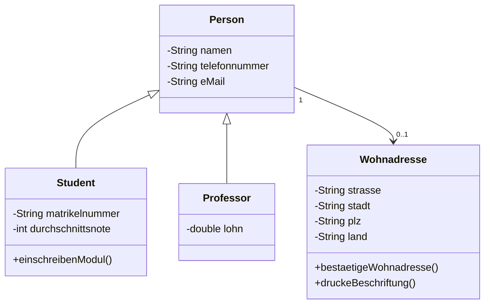

# FSE

Dokumentation und Mitschrift des Themas OOA.

Manuel Foidl

# Inhaltsverzeichnis


# OBJEKTORIENTIERTE ANALYSE

Arbeite dich in die Grundprinzipien der Objektorientierten Analyse (OOA) ein.
## Ziele
- In der Analyse geht es darum, die Anforderungen zu erfassen und zu beschreiben, die das zu entwickelnde Softwaresystem erfüllen soll.
-  alle Fakten gesammelt, dargestellt und überprüft
-  Ergebnis der Analyse ist ein allgemeines Produktmodell in Form eines objektorientierten Analyse-Modells (OOA-Modell).

## Requirements-Engineering
Ziel des Requirements Engineering (i. e. Anforderungsermittlung) ist es, die Anforderungen an ein neues Softwareprodukt zu ermitteln, zu spezifizieren, zu analysieren, zu validieren und daraus eine fachliche Lösung abzuleiten beziehungsweise ein Produktmodell zu entwickeln. Sie führen zu einem integrierten Modell der funktionalen Anforderungen, in dem alle relevanten Systemaspekte berücksichtigt sind. Nichtfunktionale Anforderungen können allerdings nur textuell oder durch individuelle Erweiterung erfasst werden.
Funktionale Anforderungen lassen sich wie folgt einteilen: 
- Anforderungen, die die Statik des Systems beschreiben,
- Anforderungen, die die Dynamik des Systems beschreiben und
- Anforderungen, die die Logik des Systems beschreiben.
Nichtfunktionale Anforderungen, auch Technische Anforderungen oder „Quality of Service“ (kurz QoS) genannt, meinen Aspekte wie Zuverlässigkeit, Verfügbarkeit, Nebenläufigkeit, Konsumierbarkeit, Internationalisierung, Informationssicherheit, Service-Anforderungen und Support.

Alle Anforderungen des Auftraggebers werden im Lastenheft niedergeschrieben. Somit ist das Lastenheft die Grundlage der Lösungsfindung. Dabei sollen folgende Ziele verfolgt werden:
- Die Beschreibung der Ausgangslage zum Projekt (Ist-Situation, Ziel und Zweck, Geltungsbereich etc.),
- die Beschreibung der Anforderungen an das zu realisierende Projekt,
- die Sicherstellung, dass wichtige Themenkreise nicht vergessen werden,
- die klare Abgrenzung zum Umfang des zu erstellenden Projekts und
- die Übereinstimmung über Art und Umfang der Projektaufgabe hinsichtlich der Vorstellungen des Auftraggebers und des Auftragnehmers.

Das Pflichtenheft hingegen beinhaltet die vom Auftragnehmer erarbeiteten Realisierungsvorgaben auf Basis des Lastenhefts. Lasten- und Pflichtenheft sollen den Systemanalytiker also in die Lage versetzen, das OOA-Modell zu erstellen.

## Strukturelle Modellierung
Zur Modellierung der inneren Struktur eines Systems werden Strukturdiagramme herangezogen. Die beiden wichtigsten Diagrammtypen des objektorientierten Designs sind Klassendiagramm und Objektdiagramm.

### Objektdiagramm
Ein Objektdiagramm kann als Sonderfall des Klassendiagramms angesehen werden. Während ein Klassendiagramm die allgemeinen „Schablonen“ und alle möglichen Beziehungen der Objekte untereinander modelliert, stellt das zugehörige Objektdiagramm die tatsächlich erzeugten Objekte, deren Attributwerte und Beziehungen innerhalb eines begrenzten Zeitraums der Laufzeit dar. Beispiel für ein Objektdiagramm: [Beispiel Objektdiagramm](https://de.wikipedia.org/wiki/Objektdiagramm)

## Dynamische Modellierung 
TODO

### Flussdiagramm
Ein Programmablaufplan (PAP) ist ein Ablaufdiagramm für ein Computerprogramm, das auch als Flussdiagramm (engl. flowchart) oder Programmstrukturplan bezeichnet wird. Es ist eine grafische Darstellung zur Umsetzung eines Algorithmus in einem Programm und beschreibt die Folge von Operationen zur Lösung einer Aufgabe. Beispiel: 

# ANFORDERUNGSANALYSE MIT ANWENDUNGSFÄLLEN
Arbeite dich in die Grundprinzipien der Anforderungsanalyse mit USE-Cases (Diagramm + textuelle Beschreibung + Mockup) ein.
## Grundlagen
Mit Anwendungsfällen (englisch use cases) werden die extern beobachtbaren Funktionen spezifiziert, das heißt das, was ein Anwendungssystem einem Benutzer anbieten soll. Ein Akteur ist dabei eine außerhalb des Systems liegende Einheit, die an der Interaktion mit dem System beteiligt ist. Dies kann ein Mensch sein, aber ebenso ein technisches System wie ein Betriebssystem oder ein Drucker. Folgende Regeln sind zu beachten:
- An jedem Anwendungsfall ist mindestens ein Akteur beteiligt.
- Jeder Anwendungsfall hat einen fachlichen Auslöser.
- Jeder Anwendungsfall produziert ein für die Akteure relevantes fachliches Ergebnis, d. h. ein Ergebnis von „geschäftlichem Wert“.

## Vorgehensweisen
Bei einer Anforderungsanalyse geht man wie folgt vor:
- Ermittlung und Analyse
- Strukturierung und Abstimmung 
- Prüfung und Bewertung
[Genauere Beschreibung der einzelnen Phasen](https://de.wikipedia.org/wiki/Anforderungsanalyse_(Informatik))
## Werkzeuge
Für die Dokumentation kann man einen entweder eine Textverarbeitungssoftware oder ein Zeichenprogramm verwenden. Die Anforderungen können erhoben werden durch die Befragung der Stakeholder z.B. mithilfe eines Fragebogens oder Interviews.

## Dokumentation
Anforderungen können textuell mithilfe von Use Cases, User Stories oder grafisch mit einem Use Case Diagramm dokumentiert werden.

# ANFORDERUNGSANALYSE MIT USER STORIES UND EPICS
Arbeite dich in die Grundprinzipien der Anforderungsanalyse mit User-Stories und Epics ein.
## Grundlagen
Ein Epic in der Anforderungsanalyse ist eine große, umfassende Anforderung oder eine Zusammenstellung von mehreren Anforderungen, die eine signifikante Funktionalität, eine Hauptfunktion oder ein Ziel für das Projekt beschreiben. Ein Epic ist normalerweise zu groß, um in einem Sprint oder einer Iteration abgeschlossen zu werden und wird in kleinere Teile aufgeteilt, die als User Stories bezeichnet werden.
## Vorgehensweisen
Um einen guten Epic zu erstellen sollten folgende Faktoren berücksichtigt werden:
1. Identifizierung der Epics
1. Definieren der Anforderungen
1. Schätzen des Umfangs des Epics
2. Priorisierung von Epics
3. Unterteilen des Epics in kleinere User Stories
4. Verfolgung des Fortschritts 
5. Überprüfung des Fortschritts
  
## Werkzeuge
Für die Formulierung von Epics ode User Stories werden Satzschablonen verwendet. Diese können wie folgt lauten: 
- Als (Rolle) möchte ich (Funktionalität), um (Nutzen) zu erreichen.
- Um (Nutzen) als (Rolle) zu erreichen, möchte ich (Funktionalität/Ziel/Wunsch).
- Als (Rolle) möchte ich (was) (warum).
- Als (wer) (wann) (wo) möchte ich (was) (warum).
Für die Erstellung der können Agile Projektmanagement-Tools verwendet werden.
## Dokumentation
TODO

# WICHTIGE UML-DIAGRAMMARTEN
Arbeite dich in folgende Diagrammarten ein:
## Klassendiagramm
Ein Klassendiagramm ist ein Strukturdiagramm der Unified Modeling Language (UML) zur grafischen Darstellung (Modellierung) von Klassen, Schnittstellen sowie deren Beziehungen. Alle möglichen Elemente und Beziehungen in einem Klassendiagramm werden hier aufgelistet: [Notation Klassendiagramm](https://de.wikipedia.org/wiki/Klassendiagramm)
Beispiel Klassendiagramm: 


## Sequenzdiagramm
Eine Sequenz von Verarbeitungsschritten, die unter bestimmten Bedingungen auszuführen ist, wird Szenario genannt. Diese Schritte sollen das Hauptziel des Akteurs realisieren und ein entsprechendes Ergebnis liefern. Man unterscheidet zwei Kategorien von Szenarios: Solche, die eine erfolgreiche Bearbeitung des Geschäftsprozesses beschreiben, und solche, die zu einem Fehlschlag führen. Sequenzdiagrammen sollen Szenarios so präzise modelliert werden, dass deren fachliche Korrektheit diskutiert werden kann, um eine geeignete Vorgabe für Design und Implementierung zu erstellen. Sequenzdiagramme beschreiben den Austausch von Nachrichten zwischen Ausprägungen mittels Lebenslinien und stellen in der Regel einen Weg durch einen Entscheidungsbaum innerhalb eines Systemablaufes dar. Sie besitzen zwei Dimensionen: Die Vertikale repräsentiert die Zeit, auf der Horizontalen werden die Objekte eingetragen. Notation eines Sequenzdiagramms: [Notation Sequenzdiagramm](https://www.uml-diagrams.org/sequence-diagrams.html) 
Beispiel: 

## Zustandsdiagramm
Der Zustand eines Objekts wird durch seine Attributwerte festgelegt. Je nachdem, in welchem Zustand sich nun ein Objekt befindet, kann es auf gleiche eingehende Nachrichten unterschiedlich reagieren. Dieses Verhalten von Objekten kann durch Zustandsautomaten modelliert werden: Dabei handelt es sich um eine Menge von Zuständen und eine Übergangsfunktion, die abhängig vom momentanen Zustand und dem eingehenden Ereignis den Nachfolgezustand bestimmt. Notation ist hier zu finden: [Notation Zustandsdiagramm](https://de.wikipedia.org/wiki/Zustandsdiagramm_(UML))
Beispiel: 


# TEXTUELLES DIAGRAMM-DESIGN-TOOL

Für das Erstellen der Diagramme wird das Tool Mermaid verwendet. Mit Mermaid können Diagramm textuell erstellt werden. 
Link: https://mermaid.live/

# USE-CASE-DIAGRAMM 1
Interpretieren Sie schriftlich das folgende Use-Case-Diagramm:

Interpretation: 
Bei diesem Use Case handelt es sich um Online Shopping. Bei dem Online Shopping gibt es einen Kunden. Dieser Kunde lässt sich in einen neuen Kunden und einen registrierten Kunden aufteilen. Ein neuer Kunde hat die Möglichkeit die Waren anzusehen oder sich zu registrieren. Das Registrieren erfordert eine Authentication damit die Registrierung abgeschlossen ist. Hingegen der bereits registrierte Kunde die Waren anschauen und auch diese bestellen kann. Das Bestellen grundsätzlich beinhaltet zwei Vorgänge, einmal das anschauen/aussuchen der Waren und den Checkout. Der Checkout verwendet verschiedene Actors, um den Checkout durchzuführen. Diese wären die Authentication, Identity Provider, Credit Payment Service, PayPal.

# USE-CASE-DIAGRAMM 2
Interpretieren Sie schriftlich das folgende Use-Case-Diagramm:

Das Use-Case-Diagramm zeigt einen Bestellvorgang bei einem Essenslieferant. Es gibt drei Actors Hungriger Kunde, Bezahlsystem, E-Mail-System. Der Hungrige Kunde kann entweder mit der Kundenregistrierung oder mit der Funktion Essen bestellen kommunizieren. Die Bestellung beinhaltet das Senden einer Bestellbestätigung. Das Bestellen wird wiederrum auch von Online bezahlen erweitert. Online bezahlen kann man entweder mit einer Kreditkarte oder mit einer EC-Karte. Das Online bezahlen kommuniziert mit dem Bezahlsystem um die Zahlung schlussendlich abzuwickeln.

# USE-CASE-DIAGRAMM 3
Entwerfen Sie ein Anwendungsfalldiagramm zu der folgenden Beschreibung:
In einem Kino kann ein Gast Kinokarten an der Kasse kaufen, die vorbestellt sein könnten. Außerdem ist es möglich Popcorn und Getränke zu bestellen. Danach bezahlt der Kunde beim Kassierer die Rechnung. Es ist auch möglich mit Kreditkarte zu bezahlen, welche bei Bedarf einer automatischen Prüfung unterzogen werden kann.

Textuell in PlantUML:
``` 
@startuml
actor Gast
actor Kassierer
rectangle Kino{
(Tickets kaufen) ..> (vorbestellen) : extends
(Snacks kaufen)
(Bezahlung)<|-- (Kreditkarte)
(Bezahlung)<|-- (Bar)
(Tickets kaufen)..>(Bezahlung) : include
(Snacks kaufen)..>(Bezahlung) : include

}
Gast -- (Tickets kaufen)
Gast -- (Snacks kaufen)
(Bezahlung) -- Kassierer
@enduml
```

Grafisch:


# USE-CASE-DIAGRAMM 4
Entwerfen Sie ein Anwendungsfalldiagramm zu der folgenden Beschreibung:
Es soll ein Anwendungssystem zur Unterstützung der Geschäftsprozesse in einem Krankenhaus entwickelt werden. Das System soll folgende Aufgaben erledigen:
- Herr Müller und Herr Maier seien in der Verwaltung angestellt.
- Herr Müller soll Mitarbeiter einstellen und entlassen können. Sowohl Herr Müller als auch Herr Maier kann Patienten aufnehmen und entlassen.
- Sowohl bei der Einstellung von Mitarbeitern, als auch bei der Aufnahme von Patienten müssen Name und Adresse erfasst werden. Um redundante Anwendungsfall-Beschreibungen zu verhindern wird diese Tätigkeit in einen gesonderten Anwendungsfall ausgelagert.
- Falls der einzustellende Mitarbeiter bzw. der aufzunehmende Patient seinen Wohnsitz am Ort des Krankenhauses hat, wird geprüft, ob die angegebene Adresse am Wohnort existiert. Lagern Sie auch diesen Anwendungsfall aus.
  
Textuell:
```
@startuml
left to right direction
actor "Verwaltung" as v
actor "Herr Maier" as ma
actor "Herr Müller" as mü
actor "Mitarbeiter" as mit
actor "Patient" as pat
v<|-- ma
v<|-- mü

rectangle Erfassung{
  usecase "Adresse erfassen" as ort
  usecase "Adresse prüfen" as prüf
  ort<..prüf : include
  usecase "Name erfassen" as n
}

rectangle "Patienten Abwicklung"{
  usecase "Patient entlassen" as ent
  usecase "Patient aufnehmen" as auf
}
rectangle "Mitarbeiter Verwaltung"{
  usecase "Mitarbeiter kündigen" as ku
  usecase "Mitarbeiter einstellen" as ein
}
v--"Patienten Abwicklung"
auf<..Erfassung : include 
ent -- pat
auf -- pat
mü -- "Mitarbeiter Verwaltung"
ein<..Erfassung : include
ku--mit
ein--mit
@enduml
```
Grafisch: 


# USE-CASE-DETAILBESCHREIBUNGEN
Definieren Sie die Use-Case-Details (level, complexity, status, pre-conditions, post-conditions and assumptions, event flow etc.) für einige Use-Cases der vorhergehenden Use-Case-Übungen. Verwenden Sie dazu eine der bereitgestellten Schablonen bzw. ein entsprechendes Software-Tool.

| Task                     | Beschreibung                                                                                                                   |
| ------------------------ | ------------------------------------------------------------------------------------------------------------------------------ |
| **Name**                 | Online Shopping                                                                                                                |
| **Ziel im Kontext**      | Produkte zu kaufen                                                                                                             |
| **Akteure**              | Kunde, Identity Provider, Credit Payment Service, PayPal, Authentication                                                       |
| **Trigger**              | Kunde besucht die Webseite und möchte etwas kaufen                                                                             |
| **Essenzielle Schritte** | 1. Produkte anschauen <br> 2. Produkte bestellen <br> 3. Checkout mit Authentifizierung und Zahlung                            |
| **Erweiterungen**        | 2a. Kunde muss registriert sein, um diese Funktion zu nutzen. <br> 2b. Registrierung erfolgt über einen Authentication Service |

# KLASSENDIAGRAMME 1

Gegeben ist folgendes Klassendiagramm:

Bestimmen Sie, ob die folgenden Aussagen zum Klassendiagramm richtig oder falsch sind.
- Es kann im System Kunden geben die nie eine Bestellung durchgeführt haben. **Richtig**
- Die Klasse Einzahlung ist die Oberklasse der Klasse Bestellung. **Falsch**
- Jedes Objekt der Klasse Bestellung_Detail besitzt genau einen Artikel. **Richtig**
- Alle Einzahlungen mit Kreditkarte haben einen Betrag. **Richtig**
- Es ist möglich, dass ein Artikel keine Assoziation mit einem Bestellung_Detail besitzt. **Richtig**
- Jedes Bestellung_Detail, das Teil einer Bestellung ist, hat seinen eigenen Status und sein eigenes Datum. **Falsch**

# KLASSENDIAGRAMME 2
Gegeben ist der folgende Sachverhalt.
Jede Person hat einen Namen, eine Telefonnummer und E-Mail. Jede Wohnadresse wird von nur einer Person bewohnt. Es kann aber sein, dass einige Wohnadressen nichtbewohnt sind. Den Wohnadressen sind je eine Strasse, eine Stadt, eine PLZ und ein Land zugeteilt. Alle Wohnadressen können bestätigt werden und als Beschriftung (für Postversand) gedruckt werden. Es gibt zwei Sorten von Personen: Student, welcher sich für ein Modul einschreiben kann und Professor, welcher einen Lohn hat. Der Student besitzt eine Matrikelnummer und eine Durchschnittsnote.
Modellieren Sie diesen Sachverhalt mit einem UML Klassendiagramm.



