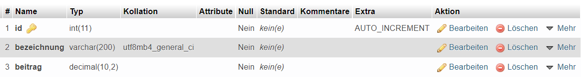
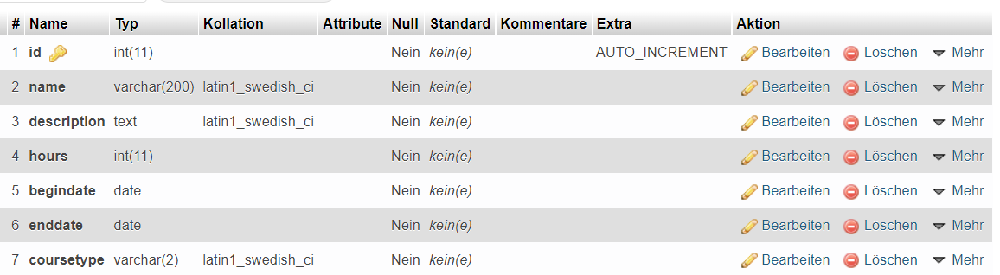

# FSE

Dokumentation und Mitschrift für fortgeschrittene Software Entwicklung.

Manuel Foidl

# Inhaltsverzeichnis

- [FSE](#fse)
- [Inhaltsverzeichnis](#inhaltsverzeichnis)
- [Datenpersistenz (JDBC)](#datenpersistenz-jdbc)
  - [JDBC Intro Teil 1](#jdbc-intro-teil-1)
    - [Entwicklungsumgebung einrichten](#entwicklungsumgebung-einrichten)
    - [Datenbankverbindung herstellen](#datenbankverbindung-herstellen)
    - [Daten abfragen](#daten-abfragen)
    - [Daten hinzufügen](#daten-hinzufügen)
    - [Daten ändern](#daten-ändern)
    - [Daten löschen](#daten-löschen)
    - [Daten abfragen 2](#daten-abfragen-2)
  - [JDBC Intro Teil 2](#jdbc-intro-teil-2)
  - [JDBC UND DAO – STUDENTEN](#jdbc-und-dao--studenten)
    - [DAO](#dao)
    - [Projektsetup](#projektsetup)
    - [DB Verbindung Singleton](#db-verbindung-singleton)
    - [UI](#ui)
    - [Domänenklassen](#domänenklassen)
    - [DAO Interfaces](#dao-interfaces)
    - [GetAll](#getall)
    - [getById](#getbyid)
    - [Insert](#insert)
    - [Update](#update)


# Datenpersistenz (JDBC)

## JDBC Intro Teil 1

### Entwicklungsumgebung einrichten

In diesem Abschnitt wird die Einrichtung der Entwicklungsumgebung für die JDBC (Java Database Connectivity).

Es wird XAMPP für die eine Instanz einer Datenbank verwendet. XAMPP wird nicht vollständig verwendet, sonder nur der Webserver und die Datenbank.

Als Entwicklungsumgebung wird IntelliJ verwendet mit dem Buildtool Maven. In der pom.xml wird die MySqlConnector Dependency eingebunden.

### Datenbankverbindung herstellen

In diesem Teil wird eine Verbindung zu einer Datenbank erstellt.

**Datenbank vorbereiten**

Um eine Verbindung mit einer Datenbank zu erstellen muss zuerst eine erstellt werden. Dazu haben wird phpMyAdmin von XAMPP verwendet. Dort wird eine Datenbank mit einer Tabelle erstellt auf die zugegriffen werden soll.

**Verbindung herstellen in JAVA**

Für die Verbindung benötigt man eine ConnectionURL, damit JAVA weiß wo sich die Datenbank befindet. Weiters wird ein User und das Passwort benötigt. 
Eine Verbindung könnte zum Beispiel so aussehen: 

```JAVA
 String connectionURL = "jdbc:mysql://localhost:3306/jdbcdemo";
        String user = "root";
        String pw = "";
        try (Connection conn = DriverManager.getConnection(connectionURL,"root", "")){

            System.out.println("Verbindung zur DB hergestellt!");
        }catch (SQLException e)
        {
            System.out.println("Fehler beim Aufbau der Verbindung zur DB: " + e.getMessage());
        }
```

### Daten abfragen

Das Abfragen von Daten der Datenbank wird in diesem Bereich dokumentiert.

Als erstes muss ein PreparedStatement erstellt werden. Dazu wird auf unser connection die PrepareStatement Funktion aufgerufen und ein SQL Statement übergeben. Dieses Statement wird dann mit der Funktion executeQuery an dem preparedStatement aufgerufen. Als Ergebnis wird ein ResultSet zurückgegeben. Mithilfe einer while Schleife und der next Funktion kann durch das Ergebnis der Abfrage iteriert werden. Die einzelnen Daten werden mit einer Get Methode und dem Namen oder Nummer der Spalte ausgelesen. Der Code kann folgendermaßen aussehen.
```java
 PreparedStatement preparedStatement = conn.prepareStatement(sqlSelectAllPersons);
            //Abfrage executen
            ResultSet rs = preparedStatement.executeQuery();
            //Durch das ResultSet iterieren mit .next()
            while (rs.next()){
               int id = rs.getInt("id");
               String name = rs.getString("name");
               String email = rs.getString("email");
               System.out.println("Student aus der DB: ID: " + id + " Name: " + name + " EMAIL: " + email);
            }

```

### Daten hinzufügen

Ähnlich wie das Abfragen von Daten wird zuerst eine Verbindung zu der Datenbank hergestellt. Es wird auch PreparedStatement erstellt wobei die zu einfügenden Daten nicht direkt in das Insert Statement geschrieben werden, sonder ? als Placeholder. Dies verhindert eine SQL Injektion und die Geschwindigkeit erhöht, da das Statement schon vorgeladen ist. Damit das Einfügen auch gemacht wird muss am preparedStatement executeUpdate aufgerufen werden. Diese Funktion gibt einen Integer zurück wie viele Zeile betroffen waren. Beispiel Code: 
```Java
 //SQL Statement vorbereiten
            PreparedStatement preparedStatement = conn.prepareStatement("INSERT INTO `student` (`id`, `name`, `email`) VALUES (NULL, ?, ?)");
            try {
                preparedStatement.setString(1, "Peter Zeck");
                preparedStatement.setString(2, "p.zeck@gmail.com");
                int rowAffected = preparedStatement.executeUpdate();
                System.out.println("Datensätze eingefügt: " + rowAffected);

            }catch (SQLException ex) {
                System.out.println("Fehler im der SQL-INSERT Statement: " + ex.getMessage());
            }
```

### Daten ändern

Um Daten zu ändern wird wieder eine Verbindung zu Datenbank erstellt. Danach wird ein preparedStatement mit einem UPDATE erstellt, wobei die Daten wieder mit einem ? später eingefügt werden. Die Daten werden mit set Funktionen eingefügt und die Anzahl der aktualisierten Daten wird mit der executeUpdate Methode zurückgegeben. 

```java
PreparedStatement preparedStatement = conn.prepareStatement("UPDATE `student`SET `name` = ?, `email`= ? WHERE `student`.`id` = 5");
            try {

                preparedStatement.setString(1, "Hans Zimmer");
                preparedStatement.setString(2, "Hans@zimmer.home");
                int affectedRows = preparedStatement.executeUpdate();
                System.out.println(affectedRows + " Datensätze geändert.");

            }catch (SQLException ex) {
                System.out.println("Fehler im der SQL-update Statement: " + ex.getMessage());
            }
```

### Daten löschen

Daten können gelöscht werden, wenn eine Verbindung zur Datenbank besteht und ein korrektes DELETE Statement als preparedStatement verwendet wird. Die Funktion wurde erweitert, indem jetzt Parameter übergeben werden können die bestimmen welcher Datensatz gelöscht werden soll.

```java
PreparedStatement preparedStatement = conn.prepareStatement("DELETE FROM `student` WHERE `student`.`id` = ?");
    try {
        //Fragezeichen auffüllen
        preparedStatement.setInt(1, studentID);
        // Statement ausführen
        int rowAffected = preparedStatement.executeUpdate();
        System.out.println("Anzahl der gelöschten Zeilen" + rowAffected);
    }catch (SQLException ex) {
        System.out.println("Fehler im der SQL-Delete Statement: " + ex.getMessage());
    }
```

### Daten abfragen 2

Der Aufbau dieser Funktion ändert sich nicht von [Daten abfragen](#daten-abfragen). Es ändert sich nur die Abfrage und es kann ein Parameter übergeben werden. Dieser Parameter bestimmt nach was gesucht werden soll. Das Select Statement ist so eingestellt, dass alle Ergebnisse die irgendwo diese Zeichenkette aufweisen, ausgegeben werden. 

```java
public static void findAllByNameLike(String pattern) {
        System.out.println("Find all by Name Demo mit JDBC");
        String sqlSelectAllPersons = "SELECT * FROM `student` WHERE  `student`.`name` LIKE ?";
        String connectionURL = "jdbc:mysql://localhost:3306/jdbcdemo";
        String user = "root";
        String pw = "";
        try (Connection conn = DriverManager.getConnection(connectionURL,"root", "")){
            System.out.println("Verbindung zur DB hergestellt!");
            //SQL Statement vorbereiten
            PreparedStatement preparedStatement = conn.prepareStatement(sqlSelectAllPersons);
            preparedStatement.setString(1,"%"+pattern+"%");
            //Abfrage executen
            ResultSet rs = preparedStatement.executeQuery();
            //Durch das ResultSet iterieren mit .next()
            while (rs.next()){
                int id = rs.getInt("id");
                String name = rs.getString("name");
                String email = rs.getString("email");
                System.out.println("Student aus der DB: ID: " + id + " Name: " + name + " EMAIL: " + email);
            }
        }catch (SQLException e)
        {
            System.out.println("Fehler beim Aufbau der Verbindung zur DB: " + e.getMessage());
        }
```

## JDBC Intro Teil 2

In diesem Abschnitt wird eine weitere Tabelle erstellt und die gleichen Funktionen implementiert.

Erstellte Tabelle:



Nun werden die einzelnen Funktionen dargestellt.

1. Select All Hobbies
```java
    /**
     * Gibt alle Datensätze aus.
     */
    public static void selectAll() {
        System.out.println("---------------------SelectAll---------------------");
        String connectionURL = "jdbc:mysql://localhost:3306/jdbcdemo";
        String user = "root";
        String pw = "";
        try (Connection conn = DriverManager.getConnection(connectionURL, user, pw)) {
            String sqlstatement = "SELECT * FROM hobbies";
            PreparedStatement preparedStatement = conn.prepareStatement(sqlstatement);
            ResultSet rs = preparedStatement.executeQuery();
            while (rs.next()) {
                int id = rs.getInt("id");
                String bezeichnung = rs.getString("bezeichnung");
                BigDecimal betrag = rs.getBigDecimal("beitrag");
                System.out.printf("Hobby: ID %d, Bezeichnung: %s, Betrag: %s %n", id, bezeichnung, betrag.toString());
            }
        } catch (SQLException e) {
            System.out.println("Fehler " + e.getMessage());
        }
    }
```
2. Insert Hobby
```java
/**
     * Fügt einen neuen Datensatz hinzu
     * @param bezeichnung Bezeichnung des Hobbies
     * @param beitrag Betrag des benötigten Vereinsbeitrages
     */
    public static void insertHobby(String bezeichnung, BigDecimal beitrag) {
        System.out.println("---------------------insertHobby---------------------");
        String connectionURL = "jdbc:mysql://localhost:3306/jdbcdemo";
        String user = "root";
        String pw = "";
        try (Connection conn = DriverManager.getConnection(connectionURL, user, pw)) {
            String sqlstatement = "INSERT INTO `hobbies` (`id`, `bezeichnung`, `beitrag`) VALUES (NULL, ?, ?)";
            PreparedStatement preparedStatement = conn.prepareStatement(sqlstatement);
            try {
                preparedStatement.setString(1, bezeichnung);
                preparedStatement.setBigDecimal(2, beitrag);
                int affectedRows = preparedStatement.executeUpdate();
                System.out.println("Datensätze hinzugefügt: " + affectedRows);
            } catch (SQLException e) {
                System.out.println("Fehler beim Insert " + e.getMessage());
            }
        } catch (SQLException e) {
            System.out.println("Fehler " + e.getMessage());
        }
    }
```
3. Update Hobby
```java
    /**
     * Aktualsiert ein Hobby.
     * @param id id des Hobbies
     * @param bezeichnung neue Bezeichnung des Hobbies
     * @param beitrag neuer Beitrag des Hobbies
     */
    public static void updateHobby(int id, String bezeichnung, BigDecimal beitrag){
        System.out.println("---------------------updateHobby---------------------");
        String connectionURL = "jdbc:mysql://localhost:3306/jdbcdemo";
        String user = "root";
        String pw = "";
        try (Connection conn = DriverManager.getConnection(connectionURL, user, pw)) {
            String sqlstatement = "UPDATE `hobbies` SET `bezeichnung` = ?, `beitrag` = ? WHERE `hobbies`.`id` = ? ";
            PreparedStatement preparedStatement = conn.prepareStatement(sqlstatement);
            try {
                preparedStatement.setString(1, bezeichnung);
                preparedStatement.setBigDecimal(2, beitrag);
                preparedStatement.setInt(3, id);
                int affectedRows = preparedStatement.executeUpdate();
                System.out.println("Datensätze geupdated: " + affectedRows);
            } catch (SQLException e) {
                System.out.println("Fehler beim Insert " + e.getMessage());
            }
        } catch (SQLException e) {
            System.out.println("Fehler " + e.getMessage());
        }
    }
```
4. Delete Hobby
```java
    /**
     * einen Datensatz löschen
     * @param id id des zu löschenden Datensatzes
     */
    public static void deleteHobby(int id){
        System.out.println("---------------------deleteHobby---------------------");
        String connectionURL = "jdbc:mysql://localhost:3306/jdbcdemo";
        String user = "root";
        String pw = "";
        try (Connection conn = DriverManager.getConnection(connectionURL, user, pw)) {
            String sqlstatement = "DELETE FROM `hobbies` WHERE `hobbies`.`id` = ?";
            PreparedStatement preparedStatement = conn.prepareStatement(sqlstatement);
            try {
                preparedStatement.setInt(1, id);
                int affectedRows = preparedStatement.executeUpdate();
                System.out.println("Datensätze gelöscht: " + affectedRows);
            } catch (SQLException e) {
                System.out.println("Fehler beim Delete " + e.getMessage());
            }
        } catch (SQLException e) {
            System.out.println("Fehler " + e.getMessage());
        }
    }
```

5. Select Hobby Like
```java
    /**
     * Gibt alle Datensätze aus die den eingegebenen String beinhalten
     * @param suche Suchstring
     */
    public static void selectHobbyLike(String suche){
        System.out.println("---------------------selectHobbyLike---------------------");
        String connectionURL = "jdbc:mysql://localhost:3306/jdbcdemo";
        String user = "root";
        String pw = "";
        try (Connection conn = DriverManager.getConnection(connectionURL, user, pw)) {
            String sqlstatement = "SELECT * FROM `hobbies` WHERE `hobbies`.`bezeichnung` LIKE ?";
            PreparedStatement preparedStatement = conn.prepareStatement(sqlstatement);
            try {
                preparedStatement.setString(1, "%"+suche+"%");
                ResultSet rs = preparedStatement.executeQuery();
                while (rs.next()) {
                    int id = rs.getInt("id");
                    String bezeichnung = rs.getString("bezeichnung");
                    BigDecimal betrag = rs.getBigDecimal("beitrag");
                    System.out.printf("Hobby: ID %d, Bezeichnung: %s, Betrag: %s %n", id, bezeichnung, betrag.toString());
                }
            } catch (SQLException e) {
                System.out.println("Fehler bei der Suche " + e.getMessage());
            }
        } catch (SQLException e) {
            System.out.println("Fehler " + e.getMessage());
        }
    }
```


## JDBC UND DAO – STUDENTEN

In diesem Abschnitt werden CRUD (Create, Read, Update, Delete) Operationen mithilfe des DAO Patterns implementiert.

### DAO

Data Access Object (DAO) ist ein Entwurfsmuster, das den Zugriff auf unterschiedliche Arten von Datenquellen (z. B. Datenbanken, Dateisystem) so kapselt, dass die angesprochene Datenquelle ausgetauscht werden kann, ohne dass der aufrufende Code geändert werden muss.

### Projektsetup

Zu beginn wird eine Datenbank die Kurssystem Datenbank erstellt, die eine Tabelle besitzt. 



Danach wird ein neues IntelliJ Projekt erstellt. Dabei wird Java und Maven verwendet. Dazu kommt noch, dass die MySQL Connector Java Dependency in die pom.xml hinzugefügt wird.
```xml
<dependency>
    <groupId>com.mysql</groupId>
    <artifactId>mysql-connector-j</artifactId>
    <version>8.0.31</version>
</dependency>
```

### DB Verbindung Singleton

Das Singleton Pattern behilft uns Codeduplikate zu vermeiden, indem man die Verbindung zur Datenbank in eine Klasse auslagert. Der Code schaut wie folgt aus:
```java
public class MysqlDatabaseConnection {
    private static Connection con = null;
    //privater Konstruktor, da kein Objekt von dieser Klasse erstellt werden soll. 
    private MysqlDatabaseConnection(){
    }

    //Gibt uns ein Objekt vom Typ Connection zurück oder eine Exception wird geworfen, wenn keine Verbindung hergestellt werden kann oder die Driver nicht verfügbar sind.
    public static Connection getConnection(String url, String user, String pwd) throws ClassNotFoundException, SQLException {
        //Prüfen ob eine Verbindung schon besteht
        if(con!=null){
            return con;
        }else{
            //Prüfen ob der Driver verfügbar ist
            Class.forName("com.mysql.cj.jdbc.Driver");
            con = DriverManager.getConnection(url, user,pwd);
            return con;
        }
    }
}
```
### UI

Als UI wird die CLI verwendet. Dafür wurde eine Klasse erstellt die den Benutzer Auswahlmöglichkeiten bietet. 

### Domänenklassen

Zu Beginn wird ein Package erstellt mit dem Namen domain. Dort landen alle domänenspezifischen Klassen. Eine Domänen Klasse wäre in diesem Fall Course. Dazu kommt noch eine abstrakte Klasse BaseEntity, die als Mutterklasse für alle Klassen der Entitäten gilt.

Klasse Course:
```java
public class Course extends BaseEntity {

    private String name;
    private String description;
    private int hours;
    private Date beginDate;
    private Date endDate;
    private CourseType courseType;
    //Konstruktor mit ID
    public Course(Long id, String name, String description, int hours, Date beginDate, Date endDate, CourseType courseType) throws InvalidValueException {
        super(id);
        this.setName(name);
        this.setDescription(description);
        this.setHours(hours);
        this.setBeginDate(beginDate);
        this.setEndDate(endDate);
        this.setCourseType(courseType);
    }
    //Konstruktor ohne ID für z.B. INSERT Statements
    public Course(String name, String description, int hours, Date beginDate, Date endDate, CourseType courseType) throws InvalidValueException {
        super(null);
        this.setName(name);
        this.setDescription(description);
        this.setHours(hours);
        this.setBeginDate(beginDate);
        this.setEndDate(endDate);
        this.setCourseType(courseType);
    }
```
In den Setter Klassen wird die Business Logik implementiert. 

Klasse BaseEntity:
```java
/**
 * Die Klasse BaseEntity dient als Mutterklasse konkreter Entitäten wie zum Beispiel Course
 * Alle weiteren Entitäten besitzen eine ID.
 */
public abstract class BaseEntity  {
     private Long id;

     public BaseEntity(Long id){
         setId(id);
     }
     public Long getId(){
         return this.id;
     }

     public void setId(Long id){
         //ID muss null oder größer gleich 0 Sein
         if(id==null|| id >=0){
             this.id = id;
         }else {
             throw new InvalidValueException("Kurs-ID muss größer gleich 0 sein");
         }
     }
}
```
### DAO Interfaces

Zu beginn wird ein Interface erstellt, dass als Base Repository dient und generische Typen verwendet.
```java
/**
 * Das Interface BaseRepository verwendet generische Typen und beinhaltet nur die CRUD Methodenköpfe.
 * @param <T> Entität
 * @param <I> ID der Entität
 */
public interface BaseRepository<T,I> {
    Optional<T> insert(T entity);
    Optional<T> getById(I id);
    List<T> getAll();
    Optional<T> update(T entity);
    void deleteById(I id);

}
```
Dieses Interface wird von MyCourseRepository geerbt. MyCourseRepository implementiert weitere Methodenköpfe.
```java
/**
 * Das Interface MyCourseRepository ist das DAO Interface und erbt von dem BaseRepository. Bei der Vererbung ist zu beachten, dass die Typen deklariert werden.
 * In diesem Interface werden weitere spezifischere Methodenköpfe hinzugefügt.
 */
public interface MyCourseRepository extends BaseRepository<Course, Long>{
 
    List<Course> findAllCoursesByName(String name);
    List<Course> findAllCoursesByDescription(String description);
    List<Course> findAllCoursesByDescriptionOrName(String searchText);
    List<Course> findAllCoursesByCourseType(CourseType courseType);
    List<Course> findAllCoursesByStartDate(Date startDate);
    List<Course> findAllRunningCourses();
}
```
### GetAll

Es wird die Funktion getAll implementiert. Dabei werden alle Kurse aus der Datenbank ausgelesen. Wird werden die Daten zu einem Objekt gemapped.
```java
    /**
     * Erstellt eine Liste von Courses und gibt diese zurück
     * @return Liste von courses
     */
    @Override
    public List<Course> getAll() {
        String sql = "SELECT * FROM `courses`";
        try {
            PreparedStatement preparedStatement = con.prepareStatement(sql);
            ResultSet resultSet = preparedStatement.executeQuery();
            ArrayList<Course> courseList = new ArrayList<>();
            while (resultSet.next()) {
                //Die Daten, die von der Datenbank kommen, werden einem neuen Course übergeben und in eine Liste hinzugefügt.
                //Objektrelationales Mapping
                courseList.add(new Course(
                                resultSet.getLong("id"),
                                resultSet.getString("name"),
                                resultSet.getString("description"),
                                resultSet.getInt("hours"),
                                resultSet.getDate("begindate"),
                                resultSet.getDate("enddate"),
                                CourseType.valueOf(resultSet.getString("coursetype"))
                        )
                );
            }
            return courseList;
        } catch (SQLException e) {
            throw new DatabaseException("Database error occured!");
        }

    }
```
### getById

Durch das Suchen mit einer ID wird eine Course im Detail angezeigt. 

```java
    /**
     * Gibt einen Course zurück, der zuvor durch die ID eindeutig bestimmt worden ist.
     * @param id ID des zur suchenden Course
     * @return Course
     */
    @Override
    public Optional<Course> getById(Long id) {
        //Utility Klasse für die NULL Prüfung der ID
        Assert.notNull(id);
        //Mithilfe einer Hilfsmethode wird geprüft, ob ein mit dieser ID existiert.
        if(countCoursesInDbWithId(id)==0){
            return Optional.empty();
        }else{
            try {
                String sql = "SELECT * FROM `courses` WHERE `id` = ? ";
                PreparedStatement preparedStatement = con.prepareStatement(sql);
                preparedStatement.setLong(1, id);
                ResultSet resultSet = preparedStatement.executeQuery();
                resultSet.next();
                //Erstellen eines Course Objekts mit dem Ergebnis der Abfrage
                Course course = new Course(
                        resultSet.getLong("id"),
                        resultSet.getString("name"),
                        resultSet.getString("description"),
                        resultSet.getInt("hours"),
                        resultSet.getDate("begindate"),
                        resultSet.getDate("enddate"),
                        CourseType.valueOf(resultSet.getString("coursetype"))
                );
                return Optional.of(course);

            }catch (SQLException sqlException){
                throw new DatabaseException(sqlException.getMessage());
            }
        }
    }
    /**
     * Hilfmethode die überprüft, ob ein Course mit der ID verfügbar ist.
     * @param id ID eines Course
     * @return Anzahl der Ergebnisse
     */
    private int countCoursesInDbWithId(Long id){
        try {
            String countSql = "SELECT COUNT(*) FROM `courses`WHERE `id`=?";
            PreparedStatement preparedStatement = con.prepareStatement(countSql);
            preparedStatement.setLong(1,id);
            ResultSet resultSetCount = preparedStatement.executeQuery();
            resultSetCount.next();
            int coursecount = resultSetCount.getInt(1);
            return coursecount;
        }catch (SQLException sqlException){
            throw new DatabaseException(sqlException.getMessage());
        }
    }
```

### Insert
In diesem Abschnitt wird ein Course hinzugefügt. 
```java
/**
     * UI Methode die den User durch das Hinzufügen führt
     */
    private void addCourse() {
        //Temporäre Datenfelder
        String name, description;
        int hours;
        Date dateFrom, dateTo;
        CourseType courseType;
        try {
            //Kursdaten eingeben und validieren
            System.out.println("Bitte alle Kursdaten angeben: ");
            System.out.println("Name: ");
            name = scan.nextLine();
            if (name.equals("")) throw new IllegalArgumentException("Eingabe darf nicht leer sein!");
            System.out.println("Beschreibung: ");
            description = scan.nextLine();
            if (description.equals("")) throw new IllegalArgumentException("Eingabe darf nicht leer sein!");
            System.out.println("Stundenanzahl: ");
            hours = Integer.parseInt(scan.nextLine());
            System.out.println("Startdatum (YYYY-MM-DD): ");
            dateFrom = Date.valueOf(scan.nextLine());
            System.out.println("Startdatum (YYYY-MM-DD): ");
            dateTo = Date.valueOf(scan.nextLine());
            System.out.println("Kurstyp: (ZA/BD/FF/OE): ");
            courseType = CourseType.valueOf(scan.nextLine());
            //Verwendet die insert Methode des repos, um einen Kurs zu erstellen.
            Optional<Course> optionalCourse = repo.insert(
                    new Course(name, description, hours, dateFrom, dateTo, courseType)
            );
            if (optionalCourse.isPresent()) {
                System.out.println("Kurs angelegt: " + optionalCourse.get());
            } else {
                System.out.println("Kurs konnte nicht angelegt werden.");
            }
        } catch (IllegalArgumentException illegalArgumentException) {
            System.out.println("Eingabefehler: " + illegalArgumentException.getMessage());
        } catch (InvalidValueException invalidValueException) {
            System.out.println("Kursdaten nicht korrekt angegeben: " + invalidValueException.getMessage());
        } catch (DatabaseException databaseException) {
            System.out.println("Datenbankfehler beim Einfügen: " + databaseException.getMessage());
        } catch (Exception exception) {
            System.out.println("unbekannter Fehler: " + exception.getMessage());
        }
    }
    /**
     * Fügt einen Course zur Datenbank hinzu.
     * @param entity das Course Objekt das hinzugefügt werden soll
     * @return ein Optional vom Typ Course.
     */
    @Override
    public Optional<Course> insert(Course entity) {
        Assert.notNull(entity);
        try {
            //Objektrelationales Mapping
            String sql = "INSERT INTO `courses` (`name`, `description`, `hours`, `begindate`, `enddate`, `coursetype`) VALUES (?,?,?,?,?,?)";
            PreparedStatement preparedStatement = con.prepareStatement(sql, Statement.RETURN_GENERATED_KEYS);
            preparedStatement.setString(1, entity.getName());
            preparedStatement.setString(2, entity.getDescription());
            preparedStatement.setInt(3, entity.getHours());
            preparedStatement.setDate(4, entity.getBeginDate());
            preparedStatement.setDate(5, entity.getEndDate());
            preparedStatement.setString(6, entity.getCourseType().toString());
            int affectedRows = preparedStatement.executeUpdate();
            //Prüfen, ob das Einfügen funktioniert hat.
            if (affectedRows == 0) {
                return Optional.empty();
            }
            //Die neu erstellte ID lassen wir uns zurückgeben.
            ResultSet generatedKeys = preparedStatement.getGeneratedKeys();
            if (generatedKeys.next()) {
                //Für die Rückgabe verwenden wird die zuvor erstellte Funktion getById
                return this.getById(generatedKeys.getLong(1));
            } else {
                return Optional.empty();
            }
        } catch (SQLException sqlException) {
            throw new DatabaseException(sqlException.getMessage());
        }
    }
```

### Update

Die CRUD Methode updated einen Course in der Datenbank. 
```java  
     /**
     * Aktualisiert einen Course in der Datenbank.
     * @param entity Course der veränder werden soll
     * @return Optional von Type Course
     */
    @Override
    public Optional<Course> update(Course entity) {

        Assert.notNull(entity);

        String sql = "UPDATE `courses` SET `name` = ?, `description` = ?, `hours` = ?, `begindate` = ?, `enddate` = ?, `coursetype` = ? WHERE `courses`.`id` = ?";
        //Prüfen, ob der mitgegebene Course in der Datenbank existiert.
        if (countCoursesInDbWithId(entity.getId()) == 0) {
            return Optional.empty();
        } else {
            try {
                PreparedStatement preparedStatement = con.prepareStatement(sql);
                preparedStatement.setString(1, entity.getName());
                preparedStatement.setString(2, entity.getDescription());
                preparedStatement.setInt(3, entity.getHours());
                preparedStatement.setDate(4, entity.getBeginDate());
                preparedStatement.setDate(5, entity.getEndDate());
                preparedStatement.setString(6, entity.getCourseType().toString());
                preparedStatement.setLong(7, entity.getId());

                int affectedRows = preparedStatement.executeUpdate();
                if (affectedRows == 0) {
                    return Optional.empty();
                } else {
                    return this.getById(entity.getId());
                }
            } catch (SQLException sqlException) {
                throw new DatabaseException(sqlException.getMessage());
            }
        }
    }
```
CLI implementierte Funktion:
```java
/**
     * Der Benutzer wird gefragt, welchen Kurs er updaten will.
     * Nach einer Prüfung, ob der Kurs vorhanden ist, können die Daten eingegeben werden.
     */
    private void updateCourseDetails() {
        System.out.println("Für welche Course ID möchten Sie die CourseDetails ändern?");
        Long courseID = Long.parseLong(scan.nextLine());
        try {
            Optional<Course> courseOptional = repo.getById(courseID);
            if(courseOptional.isEmpty()){
                System.out.println("Kurs mit der ID nicht vorhanden!");
            }else{
                Course course = courseOptional.get();
                System.out.println("Änderungen für folgenden Kurs: ");
                System.out.println(course);
                String name, description, hours, dateFrom, dateTo, courseType;
                System.out.println("Bitte neue Kursdaten angeben (Enter, falls keine Änderung gewünscht ist):");
                System.out.println("Name: ");
                name = scan.nextLine();
                System.out.println("Beschreibung: ");
                description = scan.nextLine();
                System.out.println("Hours: ");
                hours = scan.nextLine();
                System.out.println("Startdatum (YYYY-MM-DD): ");
                dateFrom = scan.nextLine();
                System.out.println("Endatum (YYYY-MM-DD): ");
                dateTo = scan.nextLine();
                System.out.println("Kurstyp (ZA/BF/FF/OE): ");
                courseType = scan.nextLine();

                Optional<Course> optionalCourseUpdated = repo.update(
                        new Course(
                                course.getId(),
                                //Kurzschreibweise eines ifelse
                                name.equals("") ? course.getName() : name,
                                description.equals("") ? course.getDescription():description,
                                hours.equals("") ? course.getHours(): Integer.parseInt(hours),
                                dateFrom.equals("") ? course.getBeginDate(): Date.valueOf(dateFrom),
                                dateTo.equals("") ? course.getEndDate(): Date.valueOf(dateTo),
                                courseType.equals("") ? course.getCourseType() : CourseType.valueOf(courseType)
                        )
                );
                //Funktionale Funktion eines Optionals
                optionalCourseUpdated.ifPresentOrElse(
                        (c)-> System.out.println("kurs aktualisiert: " + c),
                        ()-> System.out.println("Kurs konnte nicht aktualisiert werden!")
                );
            }

        }catch (Exception exception){
            System.out.println("Unbekannter Fehler bei Kursupdate: " + exception.getMessage());
        }
    }
```


