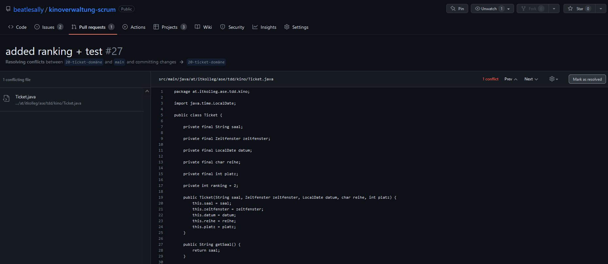

# FSE

Dokumentation und Mitschrift des Themas Scrum.

Manuel Foidl

# Inhaltsverzeichnis
- [FSE](#fse)
- [Inhaltsverzeichnis](#inhaltsverzeichnis)
- [Scrum](#scrum)
- [AUFGABE 1: SCRUM-GRUNDLAGEN](#aufgabe-1-scrum-grundlagen)
  - [Ablauf: Wie laufen SCRUM-Projekte ab?](#ablauf-wie-laufen-scrum-projekte-ab)
  - [Ereignisse: Sprint Planning, Daily Scrum, Sprint Review, Sprint Retrospective, Backlog Refinement](#ereignisse-sprint-planning-daily-scrum-sprint-review-sprint-retrospective-backlog-refinement)
  - [Rollen: Scrum-Master, Product-Owner, Developer](#rollen-scrum-master-product-owner-developer)
  - [Artefakte: User Stories, Product Backlog, Sprint Backlog, Product Increment, Burndown-Chart](#artefakte-user-stories-product-backlog-sprint-backlog-product-increment-burndown-chart)
- [AUFGABE 2: SCRUM MIT GITLAB ODER GITHUB](#aufgabe-2-scrum-mit-gitlab-oder-github)
  - [Gitlab](#gitlab)
  - [Github](#github)
- [AUFGABE 3: USER-STORIES](#aufgabe-3-user-stories)
- [AUFGABE 4: ABWICKLUNG MIT GITLAB ODER GITHUB](#aufgabe-4-abwicklung-mit-gitlab-oder-github)
- [AUFGABE 5: AGILES PM, VERSIONSKONTROLLE UND CI](#aufgabe-5-agiles-pm-versionskontrolle-und-ci)
  - [Trunkbased Development](#trunkbased-development)
  - [Github Flow](#github-flow)
- [AUFGABE 6: AGILES PM, VERSIONSKONTROLLE IN DER PRAXIS](#aufgabe-6-agiles-pm-versionskontrolle-in-der-praxis)

# Scrum
In dieser Dokumentationen werden die Aufgaben des Übungszettel bearbeitetet. 

# AUFGABE 1: SCRUM-GRUNDLAGEN
Arbeiten Sie sich in die wesentlichen Aspekte von SCRUM ein:
## Ablauf: Wie laufen SCRUM-Projekte ab?
   SCRUM-Projekte 
   Überblick:

   

## Ereignisse: Sprint Planning, Daily Scrum, Sprint Review, Sprint Retrospective, Backlog Refinement

**Sprint Planning:** 
Im Sprint Planning werden drei Fragen beantwortet:
- Warum ist der kommende Sprint wichtig?
- Was müssen wir tun, um das Sprintziel zu erreichen?
- Wie wird die daraus resultierende Arbeit im kommenden Sprint erledigt?
  
**Daily Scrum:**
Zu Beginn eines jeden Arbeitstages trifft sich das Entwicklerteam zu einem max. 15-minütigen Daily Scrum, bei dem Scrum Master und Product Owner häufig anwesend, jedoch nicht aktiv beteiligt sind, falls sie nicht selbst Backlogelemente bearbeiten. Zweck des Daily Scrum ist der Informationsaustausch. Im Daily Scrum werden keine Probleme gelöst – vielmehr geht es darum, sich einen Überblick über den aktuellen Stand der Arbeit zu verschaffen. Dazu hat sich bewährt, dass jedes Teammitglied mit Hilfe des Taskboards sagt, was es seit dem letzten Daily Scrum erreicht hat, was es bis zum nächsten Daily Scrum erreichen möchte, und was dabei im Weg steht.

**Sprint Review:**

Das Sprint Review steht am Ende des Sprints. Hier überprüft das Scrum-Team das Inkrement, um das Product Backlog bei Bedarf anzupassen. Das Entwicklungsteam präsentiert seine Ergebnisse und es wird überprüft, ob das zu Beginn gesteckte Ziel erreicht wurde. Das Scrum-Team und die Stakeholder besprechen die Ergebnisse und was als Nächstes zu tun ist.

Im Sprint Review ist die Beteiligung von Kunden und Anwendern wichtig, da diese die fertige Funktionalität des Inkrements benutzen und validieren können. Hieraus ergibt sich wichtiges Feedback für die weitere Produktgestaltung. Es kann sogar passieren, dass die Funktionalität alle Abnahmekriterien erfüllt und dennoch aus der Perspektive des Benutzers unbrauchbar ist, beispielsweise wenn ein Button an einer schwer auffindbaren Stelle platziert wurde. Häufig entsteht während des Reviews ein lebhafter Dialog, in dem den Anwesenden neue Funktionalitäten einfallen.

Das Ergebnis des Sprint Review ist das vom Product Owner notierte Feedback der Stakeholder. Dies ist eine notwendige Information bei der weiteren Gestaltung des Product Backlogs im nächsten Product-Backlog-Refinement.

**Sprint Retrospective:**

Die Sprint-Retrospektive steht am Ende eines Sprints. Hierbei überprüft das Scrum-Team seine bisherige Arbeitsweise, um sie in Zukunft effizienter und effektiver zu machen. Der Scrum Master unterstützt das Scrum-Team darin, gute Praktiken und Verbesserungen zu finden, die im nächsten Sprint umgesetzt werden. Die Retrospektive ist ein gemeinsames Ereignis des Scrum-Teams.

Das Team soll seine Arbeitsweise offen und ehrlich überprüfen können. Dazu müssen Kritik und unangenehme Wahrheiten offen geäußert werden können. Das schließt auch Gefühle und Empfindungen ein. Die Retrospektive soll daher in einem geschützten Raum ablaufen. Stakeholder dürfen nur auf Einladung dazukommen. Als Struktur für die Sprint-Retrospektive haben sich fünf Phasen bewährt.

**Backlog Refinement:**

Das Product Backlog Refinement (früher auch Backlog Grooming genannt) ist ein fortlaufender Prozess, bei dem der Product Owner und das Entwicklungsteam gemeinsam das Product Backlog weiterentwickeln. Hierzu gehören:

- Ordnen der Einträge
- Löschen von Einträgen, die nicht mehr wichtig sind
- Hinzufügen von neuen Einträgen
- Detaillieren von Einträgen
- Zusammenfassen von Einträgen
- Schätzen von Einträgen
- Planung von Releases

## Rollen: Scrum-Master, Product-Owner, Developer
   - Scrum-Master: unterstützende Rolle, kontrolliert das die Dauer des Sprints eingehalten wird
   - Product-Owner: Verbindung zum Stakeholder, legt die Anforderungen im Product Backlog und setzt Prioritäten
   - Developer: Teil des Projektteams, setzt die Anforderungen in den Sprints um und legt gemeinsam mit dem Team am Anfang des Sprints die Anforderungen für den kommenden Sprint fest
## Artefakte: User Stories, Product Backlog, Sprint Backlog, Product Increment, Burndown-Chart

**User Stories**

User Stories sind eine Technik zur Beschreibung von Anforderungen aus der Perspektive eines Benutzers unter Verwendung von Alltagssprache. In Scrum werden User Stories zur Formulierung der Product-Backlog-Einträge verwendet. Eine User Story beschreibt, welche Produkteigenschaft der Benutzer will und warum.

**Product Backlog**

Das Product Backlog ist eine geordnete Auflistung der Anforderungen an das Produkt. Das Product Backlog ist dynamisch und wird ständig weiterentwickelt. Alle Arbeit, die das Entwicklungsteam erledigt, muss ihren Ursprung im Product Backlog haben. Der Product Owner ist für die Pflege des Product Backlogs verantwortlich. Er verantwortet die Reihenfolge bzw. Priorisierung der Einträge.

Das Product Backlog ist nicht vollständig und erhebt auch nicht diesen Anspruch. Zu Beginn eines Projektes enthält es die bekannten und am besten verstandenen Anforderungen. Die Priorisierung der Eintragungen erfolgt unter Gesichtspunkten wie wirtschaftlicher Nutzen, Risiko und Notwendigkeit.

**Sprint Backlog**

Das Sprint Backlog ist der aktuelle Plan der für einen Sprint zu erledigenden Aufgaben. Es umfasst die Product-Backlog-Einträge, die für den Sprint ausgewählt wurden, und die dafür nötigen Aufgaben (z. B. Entwicklung, Test, Dokumentation). Das Sprint Backlog wird laufend nach der Erledigung einer (Teil-)Aufgabe von den Team-Mitgliedern aktualisiert. Dies dient zur Übersicht des aktuellen Bearbeitungsstands. Um es für alle sichtbar zu machen, wird häufig ein Taskboard genutzt.

**Product Increment**

Das Inkrement ist die Summe aller Product-Backlog-Einträge, die während des aktuellen und allen vorangegangenen Sprints fertiggestellt wurden. Am Ende eines Sprints muss das neue Inkrement in einem nutzbaren Zustand sein und der Definition of Done entsprechen.

**Burndown-Chart**

Das Burn-Down-Chart dient der Visualisierung bereits geleisteter und noch verbleibender Arbeit. Es gibt zwei Varianten:
- Als Sprint Burndown wird es zur Verfolgung des Sprintfortschritts verwendet.
- Als Release Burndown wird es zur Verfolgung des Produktfortschritts über mehrere Sprints hinweg verwendet.
  
Beim Sprint Burndown wird auf der horizontalen Achse der Zeitverlauf in Tagen und auf der vertikalen Achse die Anzahl der noch zu erledigenden Tasks aufgetragen. So ergibt sich eine Linie von offenen Aufgaben, die im Idealfall am Sprintende die Nulllinie trifft. Über das Sprint Burndown ist es möglich, die Erreichung des Sprint-Ziels besser abzuschätzen. Das Entwicklungsteam aktualisiert im Daily Scrum das Sprint Burndown.

# AUFGABE 2: SCRUM MIT GITLAB ODER GITHUB
Ermitteln Sie, wie man in GitLab oder GitHub SCRUM-Projektmanagement durchführt. Setzen Sie dazu die
Möglichkeiten in den beiden Plattformen kreativ ein, um die in 1) ermittelten Prozesse gut abzubilden.

Sie sollten nach der Bearbeitung eine für Sie konsistente Vorgehensweise zum Einsatz von GitLab oder GitHub
zur Unterstützung von SCRUM-Projekten gefunden haben.

## Gitlab
GitLab bietet viele Funktionen, die es ermöglichen, Scrum-Prozesse zu implementieren und zu verwalten. Hier sind einige Schritte, die Ihnen helfen können, Scrum in GitLab umzusetzen:

1. Erstellung eines Projekt: Ein neues GitLab-Projekt oder ein vorhandenes Projekt dient als Basis für ein Scrum-Projekt.

2. Backlog anlegen: Ein Backlog legt man an, indem man alle Aufgaben und User Stories speichern, die im Projekt umgesetzt werden sollen. Dies kann eine Liste von Issues oder Epics in GitLab sein.

3. Erstellung Sprints: Sprints werden erstellt, indem Meilensteine in GitLab verwendet werden. Ein Meilenstein kann einen Zeitrahmen definieren, in dem bestimmte Aufgaben abgeschlossen werden müssen.

4. Aufgaben zuweisen: Aufgaben oder User Stories können bestimmten Sprints zugeordnet werden, indem man Labels oder Meilensteine verwendet.

5. Verfolgen Sie den Fortschritt: Verfolgen Sie den Fortschritt Ihres Teams, indem Sie Issues und Merge Requests in GitLab erstellen und diese mit den entsprechenden Aufgaben oder User Stories verknüpfen.

6. Verwaltung des Meetings: GitLab-Integration mit Tools wie Zoom oder Google Meet, um Meetings wie das Daily Scrum oder Sprint Planning durchzuführen. 
   
7. Berichte und Analysen: GitLab bietet Reporting und Analytics-Funktionen, um eine bessere Sicht auf die Performance des Teams und Projekts zu erhalten. Dashboards und Diagramme helfen, Trends zu erkennen und Probleme frühzeitig zu erkennen.

## Github

GitHub bietet ähnliche Funktionen wie GitLab, um agile Prozesse wie Scrum zu unterstützen. Meist heißen die selben Funktionen nur anders.

# AUFGABE 3: USER-STORIES

Bilden Sie eine Gruppe von 4 Studenten. Pro Student ergeben sich folgende Rollen:
a. Product Owner (Selina Vötter)
b. Scrum Master (Lukas Barth)
c. Entwickler 1 (Manuel Foidl)
d. Entwickler 2 (falls nur 3 Gruppenmitglieder, genügt nur 1 Entwickler) (---)

Denken Sie sich ein fiktives Softwareentwicklungsprojekt aus und definieren Sie mindestens 5 UserStories für das Projekt. Verwenden sie dazu User-Story-Cards:

Es werden User Stories, eine Bewertung nach den INVEST Kriterien, sowie Task für eine Kinoverwaltung erstellt.

User Stories:

Für die Priorisierung wurde folgendes Punkteschema verwendet:

Bewertung nach den INVEST Kriterien.
- Independent – unabhängig. Sie sollte nach Möglichkeit nicht von anderen User Stories abhängen.
- Negotiable – verhandelbar. Sie sollte keine Umsetzungsdetails festlegen.
- Valuable – nützlich. Ihre Umsetzung erhöht den Gebrauchswert des Produkts für den Endkunden.
- Estimable – schätzbar. Der Aufwand für die Umsetzung muss abschätzbar sein.
- Small – klein. Der Aufwand für die Umsetzung sollte überschaubar sein. Erstrebenswert sind einige Arbeitstage, maximal einige Wochen.
- Testable – überprüfbar. Ihre erfolgreiche Umsetzung sollte sich mit objektiven Kriterien überprüfen lassen.

Tabelle der fertigen Bewertung:

Pro User-Story-Card werden Tasks (Aufgaben für Entwickler und Tester) definiert.

Tabelle der Tasks:

# AUFGABE 4: ABWICKLUNG MIT GITLAB ODER GITHUB

1) Richten Sie GitLab oder GitHub so ein, dass sie die Plattformen möglichst gut bei der Abwicklung der
SCRUM-Prozesse unterstützten können.

Dazu wurde ein neues Repository auf Github erstellt und die Mitglieder hinzugefügt.

2) Pflegen Sie die User-Stories aus der vorhergehenden Aufgabe ein und spielen Sie den gesamten

Zu Beginn werden die User-Stories als Issues angelegt: 

Alle Issues:

Nachdem alle Issues erstellt worden sind, wird ein Taskboard für den ersten Sprint erstellt. Das Taskboard schaut wie folgt aus: 

Danach werden die Issues, die in diesem Sprint erledigt werden, zu dem Taskboard hinzugefügt.

Sind die Issues hinzugefügt, müssen diese mit dem Label Task versehen werden.

Anschließen können die Teilnehmen zu den Task zugeordnet werden.

Die bearbeiten Tasks können nun mittels Drag-and-Drop verschoben werden. 

Github bietet eine Funktion für die Erstellung einer Grafik die den Status des Sprints wiederspiegelt.

Für den nächsten Sprint muss ein neues Taskboard erstellt werden. 

# AUFGABE 5: AGILES PM, VERSIONSKONTROLLE UND CI
Recherchieren und überlegen Sie, wie leichtgewichtige Versionskontrollmechanismen wie Trunkbased
Development oder GitHub Flow zusammen mit Continuous Integration Features der gängigen
Codeversionierungsplattformen (GitHub Actions, GitLab CI/CD) und automatisiertem Testen möglichst
produktiv und effizient in Verbindung mit SCRUM eingesetzt werden können.

## Trunkbased Development

Trunk-based development is a version control management practice where developers merge small, frequent updates to a core “trunk” or main branch. It’s a common practice among DevOps teams and part of the DevOps lifecycle since it streamlines merging and integration phases. In fact, trunk-based development is a required practice of CI/CD. Developers can create short-lived branches with a few small commits compared to other long-lived feature branching strategies. As codebase complexity and team size grow, trunk-based development helps keep production releases flowing.

## Github Flow

Bei der Github Flow Strategie wird ein Development Branch erstellt und von diesem gehen für jedes Feature ein weiterer Branch weg. Ist das Feature fertig (z.B. am Ende eines Sprints) wird diese mittels eines Pull Requests auf den Development Branch gemerged. Danach wird der Development Branch auf den Master Branch gemerged.

# AUFGABE 6: AGILES PM, VERSIONSKONTROLLE IN DER PRAXIS
Spielen Sie einen kompletten Prozess im Sinne von 5) praktisch durch.
- Setzen Sie die bekannten Versionierungsfunktionen ein.
- Setzen Sie die in den vorhergehenden Aufgaben ermittelten SCRUM-Funktionen ein.
- Wenden Sie eine leichtgewichtige Branching-Strategie an

Zu Beginn wurde das Kino Projekt aus TDD auf das Repository gepusht. Danach wurde ein Cycle der Github-Flow Strategie durchgespielt. 

 

  

  

  

  

  

- Wenden sie automatische Tests und CI/CD-Pipelines an
  
  Eine CI/CD-Pipeline kann über die Github Actions Funktion erstellt werden. Hierbei wird eine Vorlage für ein Java Projekt mit Maven verwendet. In der erzeugten yaml Datei musste noch die Java Version angepasst werden und etwas optionales herausgelöscht. Die Pipeline springt an, wenn ein Pull Request oder ein Push auf den Main Branch stattfindet.

  

  

 

  

