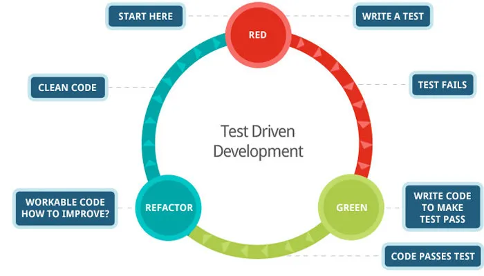
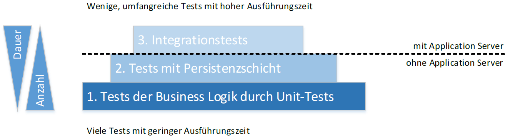
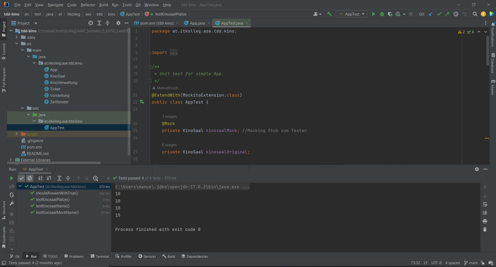

# FSE

Dokumentation und Mitschrift des Themas TDD.

Manuel Foidl

# AUFGABE 1: THEORIE
Arbeite dich in die Theorie zum Thema Testen bzw. Test-Driven-Development (TDD) ein. Nach dieser Aufgabe musst du
folgende Punkte erklären können:
- Testdriven Development
- Red-Green-Refactor
- FIRST-Acronym
- Kent Beck (welche Rolle spielt er in Bezug auf TDD)
- Testarten
  - Unit-Tests (Sociable, Solitary, Mocks)
  - Integrationstests
  - UI-Tests / End-To-End Tests / Systemtests
  - Akzeptanztests
- Testpyramide
- JUNIT (Junit5)
- Mockito (Sinn und Funktionsweise von Mocking-Bibliotheken)

## Testdriven Development
Bei TDD werden bei dem Erstellen eines neuen Projekts mit den Tests begonnen. Danach wird der Code geschrieben, um die Tests von Rot auf Grün zu bringen.

## Red-Green-Refactor


Unit-Tests und mit ihnen getestete Units werden stets parallel entwickelt. Die eigentliche Programmierung erfolgt in kleinen, wiederholten Mikroiterationen. Eine solche Iteration, die nur wenige Minuten dauern sollte, hat drei Hauptteile, die man im englischen Red-Green-Refactor nennt.


## FIRST-Acronym

First principles of testing stand for

- Fast
- Isolated/Independent
- Repeatable
- Self-validating
- thorough


## Kent Beck
Der Wiederentdecker von TDD Kent Beck verrät, dass er die Idee aus einem äußerst alten Programmierhandbuch übernommen hat. Tatsächlich lassen sich die Ursprünge bis hin zu John von Neumann ins Jahr 1957 zurückverfolgen, der TDD seinerzeit mit vorgestanzten Lochstreifen betrieb.
Erst 1989 entwickelte Kent Beck sUnit für Smalltalk und später jUnit für Java und begründete damit das moderne TDD. Über 60 Jahre TDD sind Grund genug zu fragen, wie sich die Methodik seither weiterentwickelt hat.

## Testarten
Test werden in verschiedenen Arten unterteil. Diese Arten unterscheiden sich in der Art was getestet wird. 
### Unit-Tests (Sociable, Solitary, Mocks)
Ein Unittest (zu Deutsch auch Modultest oder Komponententests) bezeichnet das Testen der einzelnen Bestandteile eines Softwaresystems auf deren korrekte Funktionsweise. Die Tests stellen die granularste Möglichkeit dar Softwarebestandteile zu testen.

### Integrationstests
- Test des korrekten Zusammenspiels mehrerer
Programmbausteine (die jeweils für sich oft bereits
erfolgreich dem Unit Test unterzogen wurden)
- Es wird also hauptsächlich getestet, ob die definierten
Schnittstellen korrekt spezifiziert und implementiert sind
- Ausführung in speziellen Testumgebungen
- Einsatz von Automatisierungswerkzeugen äußerst sinnvoll

### UI-Tests / End-To-End Tests / Systemtests
- Test auf Funktionsfähigkeit des gesamten Systems entsprechend
der Anforderungen (Spezifikation)
- Reiner funktionaler Black-Box Test
- Zusätzlich: Security-, Performance-, Last-, Stress-, RobustheitsTest und auch andere Tests zu nicht-funktionalen Anforderungen
- Spezialfall System-Integrationstest:
Es wird das Zusammenspiel des Systems mit anderen Systemen
in seiner Umwelt getestet
- Automatisierung erstrebenswert, oft aber nicht sinnvoll möglich

### Akzeptanztests
- In Zielumgebung unter echten Einsatzbedingungen
- Test auf Erwartungen der Anwender bzw. des Kunden
- Bestätigung der Gebrauchstauglichkeit und der äußeren Qualität der
Software
- Reiner Black-Box Test
- Ideal: Abnahmekriterien aus Auftrag
- Endgültiger System-Integrationstest (Zusammenspiel des Systems mit
anderen Systemen in Zielumgebung)
- Automatisierung erstrebenswert (Regressionstests zu alten Funktionen),
allerdings neue Funktionen meist manuell durch Kunde

## Testpyramide


Die Basis bilden einfache Unit Tests. Diese prüfen einen Großteil der Business Logik ab. Darauf setzen weitere Tests, welche durch Einbeziehung der Persistenzschicht eine höhere Komplexität aufweisen. Hier kann eine Unterteilung in zwei Teilebenen die Ausführung vereinfachen. Zum einen können Tests gegen eine In-Memory-DB ausgeführt werden. Dies beschränkt die Tests auf den lokalen Entwicklerrechner und reduziert damit Störungen durch Änderungen an der Testumgebung. Zum anderen ist der Datenbestand einer entsprechenden Datenbank immer identisch und somit ist eine Eindeutigkeit von Testergebnissen sichergestellt. Die Arbeit mit Realdaten ist aber in jedem Fall notwendig. Die oberste Testebene stellen dann Integrationstests dar. Nur auf einer Serverumgebung können Elemente wie Korrektheit von Konfigurationen, Firewall, Netzwerkperformance und Zusammenspiel aller Anwendungen in entsprechenden Versionen geprüft werden.

## JUNIT (Junit5)
JUnit ist das mit Abstand am weitesten verbreitete Framework zur Erstellung von Tests für Java-Programme. Es fokussiert die Erstellung von automatisierten Modultests für Java-Methoden. Das Framework wurde ursprünglich von Erich Gamme und Kent Beck entwickelt und orientierte sich an SUnit für Smalltalk.

JUnit 5 ist die aktuellste Version des JUnit Frameworks. Das 5te Majorrelease ist deswegen einen gesonderten Blick wert, weil mit ihm das Framework grundlegend überarbeitet wurde. Mit dem Upgrade auf die Version 5 wurde das populäre Testframework erstmals in verschiedene Module aufgeteilt. Hintergrund der Modularisierung sind die zunehmend aufkommenden Anforderungen an die Integrationsfähigkeit von und in JUnit.

## Mockito

Mockito ist eine open source Framework für das Erstellen von mocking Objekte für Software Tests. Ein Mock Objekt ist eine Dummy Implementierung einer Klasse oder Interface und erlaubt es uns Werte bei bestimmten Methodenaufrufe zurückzusenden. Somit muss man kein konkretes Objekt erstellen. 


# AUFGABE 2: AUSGANGSPROJEKT
Laden Sie sich das gegebene Maven-Ausgangsprojekt („TDD Kino Demo“, siehe Moodle) herunter. Laden Sie es
als Maven-Projekt in ihre IDE und schauen Sie sich an, wie das Projekt aufgebaut ist:
- pom.xml (Dependencies, Java-Version etc.)
- Gegebene Domänen-Klassen (Kinosaal, Ticket etc.)
- Gegebene Start-Junit5-Tests in test /java/at.itkolleg/AppTest
Starten Sie den Test AppTest über den grünen Pfeil und versichern Sie sich, dass alles korrekt läuft. Starten Sie
auch die App (main-Methode).



# AUFGABE 3: EINARBEITUNG IN DEN GEGEBENEN CODE
Arbeiten Sie sich in den gegebenen Code zur Kinoverwaltung ein. Verwenden Sie die gegebenen Klassen
KinoSaal, Ticket, Vorstellung, Kinoverwaltung in der App-Klasse (main-Methode), um ein Gefühl für die
Funktionsweise des Programms zu bekommen. Führen Sie folgende Punkte durch:
- Kinosäle anlegen
- Vorstellungen anlegen
- Vorstellungen über die Kinoverwaltung einplanen
- Tickets für Vorstellungen ausgeben
- etc.
```java
public class App 
{
    public static void main( String[] args )
    {
        //Saal anlegen
        Map<Character,Integer> map = new HashMap<>();
        map.put('A',10);
        map.put('B',10);
        map.put('C',15);
        map.put('D',12);
        KinoSaal ks = new KinoSaal("LadyX",map);

        //Platz prüfen
        System.out.println(ks.pruefePlatz('A',11));
        System.out.println(ks.pruefePlatz('A',10));
        System.out.println(ks.pruefePlatz('B',10));
        System.out.println(ks.pruefePlatz('C',14));

        //Vorstellung erstellen
        Vorstellung vorstellung = new Vorstellung(ks,Zeitfenster.ABEND, LocalDate.of(2023,3,29), "Der gestiefelte Kater", 10);
        //KinoVerwaltung erstellen und Vorstellung einplanen
        KinoVerwaltung kinoVerwaltung = new KinoVerwaltung();
        kinoVerwaltung.einplanenVorstellung(vorstellung);
        //Ticket bei der Kinoverwaltung kaufen
        kinoVerwaltung.kaufeTicket(vorstellung, 'D', 12, 21);
    }
}
```

# AUFGABE 4: JUNIT-TESTS FÜR KINOSAAL
Testen Sie alle Methoden der Klasse KinoSaal (Testklasse TestKinoSaal)
In diesem Beispiel wurde mit Mockito getestet.
```java
package at.itkolleg.ase.tdd.kino;

import org.junit.jupiter.api.Test;
import org.junit.jupiter.api.extension.ExtendWith;
import org.mockito.Mock;
import org.mockito.Mockito;
import org.mockito.junit.jupiter.MockitoExtension;

import static org.junit.jupiter.api.Assertions.assertEquals;

@ExtendWith(MockitoExtension.class)
public class TestKinoSaal {

    @Mock
    private KinoSaal kinosaalMock;

    @Test
    void testKinosaalNameMock(){
        //wenn vom Stub die getName aufgerufen wird, soll KS1 zurückkommen
        Mockito.when(kinosaalMock.getName()).thenReturn("KS1");
        //Schauen ob der Wert korrekt gemockt wurde
        assertEquals("KS1", kinosaalMock.getName());
        //Verifizieren ob getName() aufgerufen worden ist
        Mockito.verify(kinosaalMock).getName();
    }
    @Test
    void testKinosallPruefePlatzMock(){

        Mockito.when(kinosaalMock.pruefePlatz('D', 12)).thenReturn(true);
        Mockito.when(kinosaalMock.pruefePlatz('A', 13)).thenReturn(false);

        assertEquals(true, kinosaalMock.pruefePlatz('D', 12));
        assertEquals(false, kinosaalMock.pruefePlatz('A', 13));

        Mockito.verify(kinosaalMock).pruefePlatz('D',12);
        Mockito.verify(kinosaalMock).pruefePlatz('A',13);
    }  
}
```
# AUFGABE 5: JUNIT-TESTS FÜR VORSTELLUNG
Testen Sie alle Methoden der Klasse Vorstellung (Testklasse TestVorstellung).
In diesem Beispiel wird kein Mockito verwendet.

```java
public class TestVorstellung {
    private Vorstellung vorstellung;
    private KinoSaal ks;

    @BeforeEach
    void setup(){
        Map<Character,Integer> map = new HashMap<>();
        map.put('A',10);
        map.put('B',10);
        map.put('C',15);
        map.put('D',12);
        ks = new KinoSaal("Saal 5",map);
        vorstellung = new Vorstellung(ks, Zeitfenster.ABEND, LocalDate.of(2023,3,29), "Avengers 10", 8);
    }

    @Test
    void testGetterVorstellung(){
        assertEquals(ks, vorstellung.getSaal());
        assertEquals(LocalDate.of(2023,3,29),vorstellung.getDatum());
        assertEquals(Zeitfenster.ABEND,vorstellung.getZeitfenster());
        assertEquals("Avengers 10",vorstellung.getFilm());
    }
    @Test
    void testKaufeTicket(){

        Ticket ticket1 = vorstellung.kaufeTicket('A',10,10);
        assertEquals('A', ticket1.getReihe());
        assertEquals(10,ticket1.getPlatz());
        assertEquals(LocalDate.of(2023,3,29),ticket1.getDatum());
        assertEquals(Zeitfenster.ABEND,ticket1.getZeitfenster());
        assertEquals("Saal 5",ticket1.getSaal());

        //Testen, ob die die Exception geworfen wird.
        Exception exception = assertThrows(IllegalArgumentException.class, ()->{
            vorstellung.kaufeTicket('A',10,0);
        });
        assertTrue(exception.getMessage().contains("Nicht ausreichend Geld."));
    }
}
```
# AUFGABE 6: JUNIT-TESTS FÜR KINOVERWALTUNG
Testen Sie alle Methoden der Klasse KinoVerwaltung (Testklasse TestKinoverwaltung).

```java
public class TestKinoverwaltung {

    KinoVerwaltung kinoVerwaltung;
    List<Vorstellung> vorstellungen;
    private Vorstellung vorstellung;
    private KinoSaal ks;

    @BeforeEach
    void setup(){
        kinoVerwaltung = new KinoVerwaltung();
        Map<Character,Integer> map = new HashMap<>();
        map.put('A',10);
        map.put('B',10);
        map.put('C',15);
        map.put('D',12);
        ks = new KinoSaal("Saal 5",map);
        vorstellung = new Vorstellung(ks, Zeitfenster.ABEND, LocalDate.of(2023,3,29), "Avengers 10", 8);
    }
    @Test
    void testeinplanenVorstellung(){
        kinoVerwaltung.einplanenVorstellung(vorstellung);
        //Prüfen die Vorstellung in die Liste aufgenommen worden ist
        assertTrue(kinoVerwaltung.getVorstellungen().contains(vorstellung));
        //Testen, ob die Exception geworfen worden wird, wenn die Vorstellung schon in der Liste vorhanden ist.
        Exception exception = assertThrows(IllegalArgumentException.class, ()->{
            kinoVerwaltung.einplanenVorstellung(vorstellung);
        });
        assertTrue(exception.getMessage().contains("Die Vorstellung ist bereits eingeplant"));
    }
    @Test
    void testkaufeTicket(){
        Ticket ticket = new Ticket(ks.getName(), Zeitfenster.ABEND, LocalDate.of(2023, 3, 29), 'A', 10);
        Ticket ticketfunc = kinoVerwaltung.kaufeTicket(vorstellung, 'A', 10, 10);
        assertEquals(ticket.getPlatz(),ticketfunc.getPlatz());
        assertEquals(ticket.getReihe(),ticketfunc.getReihe());
        assertEquals(ticket.getSaal(),ticketfunc.getSaal());
        assertEquals(ticket.getZeitfenster(),ticketfunc.getZeitfenster());

        //Testen, ob der Platz schon belegt ist.
        Exception exception = assertThrows(IllegalStateException.class, ()->{
            kinoVerwaltung.kaufeTicket(vorstellung, 'A', 10, 10);
        });
        assertTrue(exception.getMessage().contains("Der Platz " + ticket.getReihe() + ticket.getPlatz() + " ist bereits belegt."));
    }
}
```
# AUFGABE 7: JUNIT-TESTS ADVANCED
Falls nicht schon in den vorhergehenden Aufgaben passiert, testen Sie folgende Punkte unter Verwendung der
fortgeschrittenen Features von JUNIT 5:
1. Schreiben Sie einen Test, der validiert, dass das Anlegen einer Vorstellung korrekt funktioniert. Der
Test sollte eine fachliche Bezeichnung haben und die Assertions sollten bei Validierungsfehler eine
Hinweistext liefern.


2. Schreiben Sie einen Test, der validiert, dass das Einplanen mehrerer Vorstellungen korrekt
funktioniert. Stellen Sie zudem sicher, dass beim möglichen Auftreten eines Fehlers trotzdem alle
Validierungen ausgeführt werden.
3. Schreiben Sie einen Test, der sicherstellt, dass ein Fehler geworfen wird, wenn eine Veranstaltung
doppelt eingeplant wird.
4. Schreiben Sie einen parametrisierten Test, der mehrere Ticketkäufe mit unterschiedlichen Parametern
überprüft.
5. Schreiben Sie eine dynamische TestFactory die den Ticketkauf mit zufälligen Werten bombardiert. Der
Test soll sicherstellen, dass der Ticketkauf entweder funktioniert oder nur einen der definierten
Fehlermeldungen (z.B. new IllegalArgumentException("Nicht ausreichend Geld.")) ausgibt. Die Tests
müssen reproduzierbar sein.


